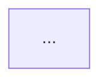

# CodeWiki 그래프 → Markdown 문서 생성

Vanuatu.sln을 Roslyn으로 분석해 적재한 **Neo4j 코드 지식 그래프**를 질의하고, 그 결과를
사람이 읽을 수 있는 **구조화된 Markdown 문서**(Mermaid 다이어그램 + 표 + 설명)로 조립한다.
산출물은 `docs/graphDoc/<주제>.md`에 저장한다.

이 그래프는 "JOIN을 미리 해둔" Vanuatu 코드의 ER 다이어그램이다. 화면(View)→ViewModel→
Command→핸들러→`CALLS`→**인터페이스 메서드(경계 허브)**→`IMPLEMENTS_METHOD`→서버 구현→
`USES`→Entity 까지가 한 번의 순회로 이어진다. 이 골격을 문서로 푸는 것이 이 스킬의 일이다.

## 전제 조건 (먼저 확인)

질의는 **`mcp__neo4j__read_neo4j_cypher`** 도구로 한다(읽기 전용). 시작 전에 그래프가 적재돼
있는지 가볍게 확인하라:

```cypher
MATCH (n) RETURN count(n) AS nodes
```

- 결과가 ~21,300 근처면 정상. **0이거나 도구 호출이 실패하면** 그래프가 비어있거나 Neo4j가
  안 떠 있는 것이다. 이때는 문서를 지어내지 말고, 사용자에게 적재 방법을 안내하라:
  `dotnet run --project src/CodeWiki -c Release -- load -c "neo4j:neo4j:strazhpass" --ndjson out/graph.ndjson --wipe`
  (자세히는 저장소 [README.md](../../../README.md) §2~§3).

### 의미 계층(enrich) 확인 — 있으면 문서가 풍성해진다

구조 그래프 위에 `enrich`가 입힌 **LLM 한국어 요약**(`summary`)이 노드에 있으면, 표·다이어그램의
각 노드에 "무슨 일을 하나"를 자연어로 붙여 *구조 + 의미* 문서를 만들 수 있다. 시작 전 커버리지 한 번:

```cypher
MATCH (n:Node) WHERE n.summary IS NOT NULL RETURN count(n) AS enriched
```

- **>0이면** 해당 노드들(`ViewModel`·핸들러 `Method`·서버 `Method` 등)에 `n.summary`가 있다 →
  조립 단계에서 이름 옆에 요약을 실어라(아래 워크플로우 4, 유형 A/B, 레시피 §3-E).
- **0이면** 아직 enrich 안 된 것 — 구조만으로 문서를 만들고, 코드 설명이 필요하면 소스 보강(아래).
- ⚠️ **부분 커버리지**: enrich한 대상만 `summary`를 가진다. 없는 노드는 그냥 비는 것이지 "코드에 없음"이 아니다.
- ⚠️ **의미는 보조(advisory)**: `summary`가 구조/이름과 모순되면 `Read`로 소스를 확인하고 소스를 따른다.

## 워크플로우 (5단계)

1. **의도 분류** — 요청이 아래 어느 결과물 유형인지 정한다(영향도 / E2E 추적 / VM 도시에 /
   호출 트리 / 서비스 인벤토리 / 자유·구조 개요). 애매하면 한 줄로 사용자에게 확인한다.
2. **시작점 식별** — 사용자가 준 식별자(타입·ViewModel·View·서비스·엔티티 이름)를 그래프에서
   먼저 찾아 **존재를 확인**한다. `name`은 짧아 동명이 있으니, 여러 개면 `fullName`으로 구분해
   어느 것인지 사용자에게 되묻거나 가장 그럴듯한 것을 골라 명시한다.
   ```cypher
   MATCH (n {name:$name}) RETURN labels(n) AS kind, n.fullName AS fullName LIMIT 25
   ```
3. **질의** — `references/cypher-recipes.md`의 검증된 레시피를 골라 실행한다. 레시피는
   파라미터(`$name` 등)만 바꿔 쓰고, 필요하면 결과를 보고 한 단계씩 좁혀 추가 질의한다.
   한 번에 거대 쿼리를 던지기보다, **시작점 확인 → 골격 → 세부**로 점진적으로 판다.
4. **조립** — 결과를 아래 출력 템플릿에 맞춰 Markdown으로 짠다. 표는 Cypher 결과를 그대로,
   흐름은 Mermaid로 변환한다(변환법은 recipes 문서 끝). **`summary`가 있으면** 각 행·노드에
   자연어 설명을 실어 "구조 + 의미" 문서로 만든다(있는 것만, 없으면 그 칸은 생략/비고).
5. **저장·검증** — `docs/graphDoc/<주제>.md`로 저장하고, 마지막에 "근거 Cypher"를 함께 넣어
   사용자가 재현할 수 있게 한다. 빈 결과가 나오면 "코드에 없음"으로 단정하지 말고 빌드 커버리지
   한계(아래 ⚠️)를 의심해 한 줄 남긴다.

## 결과물 유형과 출력 템플릿

각 유형의 **정확한 Cypher**는 `references/cypher-recipes.md`에 있다. 여기서는 *무엇을 담는지*만.

### A. 화면 → DB E2E 추적
한 화면의 한 동작이 DB(Entity)까지 가는 단일 경로. 산출:
- Mermaid `graph TD` 체인 (View→VM→Command→핸들러→…→인터페이스→서버구현→Entity)
- 경로 단계 표 (단계 / 노드 / 역할 / **하는 일(`summary`, 있으면)**)
- 한 문단 설명 + 근거 Cypher

### B. ViewModel 도시에 (한 화면의 전모)
"이 ViewModel을 고르면 가능한 모든 동작과 각자 닿는 서버·엔티티." 산출:
- 머리말: VM 노드의 `summary`(있으면) = "이 화면 한 줄 정의"
- 커맨드별 표: `커맨드 | **하는 일(summary)** | 인터페이스 메서드 | 서버 구현 | 종착 엔티티`
  (`하는 일` 칸은 enrich된 핸들러만 채워짐 — 없으면 비움. enrich되면 구조 표가 바로 화면 기능 명세가 된다)
- 서버 미경유(순수 UI) 커맨드는 별도로 표기(누락이 아니라 분류임을 명시)
- 화면 단위 기능 요약 문단

### C. 타입/DTO 변경 영향도
"이 타입을 바꾸면 어디가 깨지나"의 누락 없는 상위집합. 산출:
- 1차(직접 참조) 표: `소유 타입 | 메서드` + 역할(ViewModel/Service/Controller…)
- 2차(호출 전파) 표: 1차 메서드를 부르는 상위 호출자
- "경계 양쪽(클라/서버)이 같은 인터페이스를 구현하므로 함께 영향" 같은 해석 문단

### D. 호출 트리 / 서비스 인벤토리 / 구조 개요
- 호출 트리: 특정 메서드의 정·역방향 호출(`CALLS*`)을 Mermaid/리스트로.
- 서비스 인벤토리: 클라 REST 프록시 ↔ 서버 구현 쌍 표.
- 구조 개요: 프로젝트·의존(`DEPENDS_ON`), 노드/엣지 통계, 순환 의존.

**공통 문서 골격** (이 순서를 지켜라 — 읽는 사람이 결론부터 보게):
```markdown
# <주제>

> 생성: CodeWiki 그래프(Vanuatu.sln) · 도구: mcp-neo4j-cypher

## 요약
<3~5문장. 무엇을 답했고 핵심 결론이 무엇인지.>

## 다이어그램


## 상세
<표 + 설명. 유형별 위 내용.>

## 근거 Cypher
<실제로 실행해 이 문서를 만든 쿼리들. 사용자가 Browser에서 재현 가능하도록.>

## 유의
<빈 결과·커버리지·이름 충돌 등 해당 시에만.>
```

## 의미·소스 보강 (summary 우선, 소스는 폴백)

"무슨 일을 하는지" 설명은 **두 출처**에서 온다. enrich된 노드의 `summary`가 1차, 소스 본문이 폴백이다.

1. **summary 우선(enrich)** — 노드에 `summary`가 있으면 그게 즉시 쓸 수 있는 자연어 설명이다.
   유형 A/B/D 질의에 `h.summary`/`impl.summary`/`vm.summary`를 함께 RETURN해 표·문단에 바로 싣는다
   (레시피 §3-E, 저장소 [cookbook §7](../../../docs/cookbook.md)). 없는 노드는 비고 처리.
2. **소스 폴백(`Read`/`Grep`)** — `summary`가 없거나, 더 깊은 코드 스니펫·정확한 라인 인용이 필요할 때만
   Vanuatu 소스를 직접 연다:
   - Vanuatu 루트: `C:\develop\baw\phase2\baw-phase2-platform\Vanuatu\`
   - 그래프의 `fullName`(예: `Torba.Service.Order.OrderService.SearchOrdersAsync`)으로 타입/메서드명을
     `Grep`해 파일을 찾고, 해당 메서드만 `Read`해 인용한다. 전체 파일 덤프 금지. 출처(파일:라인) 명기.
3. ⚠️ **summary는 보조, 코드가 ground truth** — `summary`와 소스가 어긋나면 소스를 따르고 문서에 한 줄
   남긴다. `summary`엔 생성 모델(`summaryModel`)이 붙어 있으니 필요하면 출처로 밝힌다.

## 저장 규칙

- 경로: `docs/graphDoc/<kebab-주제>.md` (예: `docs/graphDoc/search-order-e2e.md`,
  `docs/graphDoc/orderdto-impact.md`, `docs/graphDoc/search-order-viewmodel-dossier.md`).
- 디렉터리가 없으면 만든다. 같은 주제 재생성 시 덮어쓰되, 사용자가 비교를 원하면 접미사로 구분.
- 저장 후 사용자에게 경로를 클릭 가능한 링크로 안내한다.

## ⚠️ 그래프의 한계 (문서에 거짓을 넣지 않기 위해)

`references/cypher-recipes.md` §유의에 상세. 핵심:
- **빈 결과 ≠ 코드에 없음.** 빌드 실패 모듈은 그래프에서 빠진다. 단정 금지, 커버리지부터 의심.
- **이름 충돌.** 정밀 식별은 `fullName`/`pk`. 서비스는 클라/서버로 같은 이름이 2개씩 보인다.
- **경계는 인터페이스 메서드 허브로만.** 라우트 문자열·DI 등록은 비목표. 끝단은 `Repository<T>`의
  Entity까지(DbContext·테이블명 없음).
- **사각지대:** raw SQL(`CallRawSQL`), `DTOGenerator` 산출물.
- **의미(`summary`)는 보조·부분 커버리지.** enrich한 노드만 가진다(없음=미enrich, 코드에 없음 아님).
  구조·이름과 모순되면 소스 확인 후 소스를 따른다.

## 더 깊은 참조

- `references/cypher-recipes.md` — 스키마 요약 + 결과물별 검증 Cypher + Mermaid 변환법(이 스킬의 핵심 자산).
- 저장소 [docs/cookbook.md](../../../docs/cookbook.md) — SQL 대조 학습 + 레시피·워크드 예제 + **§7 의미 계층(enrich) 활용**(summary로 코드 읽기·검색).
- 저장소 [docs/codewiki-spec.md](../../../docs/codewiki-spec.md) §6 — 스키마 정본.
