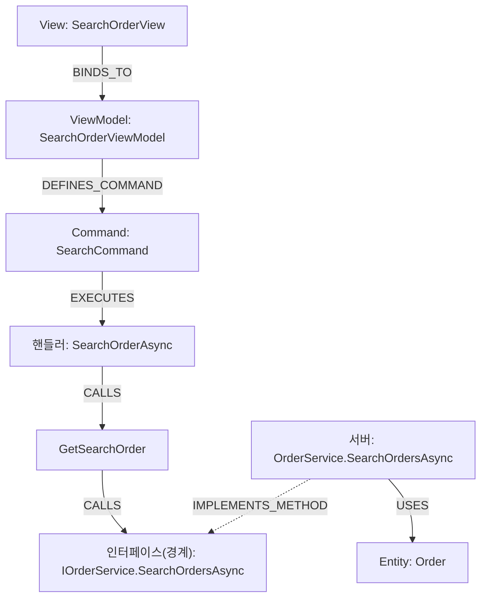

# CodeWiki Cypher 레시피 (검증됨)

> 이 스킬이 쓰는 스키마·질의·변환의 단일 참조. 모든 Cypher·식별자·수치는 Vanuatu.sln 실측
> 그래프(21,300 노드 / 72,522 엣지 / 42 프로젝트)로 검증됨. 더 깊은 학습·예제는 저장소
> `docs/cookbook.md`.

## 목차
1. 스키마 요약 (라벨·엣지·프로퍼티·네임스페이스)
2. 경계 관통 패턴 (가장 중요)
3. 레시피 — A. E2E / B. VM 도시에 / C. 영향도 / D. 호출트리·인벤토리·구조
4. Mermaid 변환법
5. 유의 (그래프의 한계)

---

## 1. 스키마 요약

**구조 라벨(1차):** `Method`(12,979) `Class`(3,358) `File`(2,945) `Command`(1,204)
`Package`(532) `Interface`(239) `Project`(42) `Solution`(1)
**역할 라벨(2차, 다중):** `DTO`(563) `ViewModel`(499) `Entity`(378) `View`(355)
`Repository`(139) `Service`(51) `Controller`(36) — 예 `(:Class:ViewModel)`.
**공통 프로퍼티:** `pk`(식별키·인덱스) · `name`(짧은 이름) · `fullName`(정규화 전체 이름).
`Method`만 `arguments`/`returnType` 추가(오버로드 구분). 모든 노드는 공유 `:Node` 라벨도 가짐.
**`Folder` 라벨은 미사용**(파일 입자는 `:File`까지).

**의미 계층(enrich, 선택):** `enrich`된 노드는 `summary`(LLM 한국어 요약)·`summaryModel`(생성 모델)·
`summaryHash`(델타-스킵 키)도 가진다. **부분 커버리지**(enrich한 대상만, 보통 `ViewModel`·핸들러 `Method`).
커버리지 확인: `MATCH (n:Node) WHERE n.summary IS NOT NULL RETURN count(n)`. 보조(advisory) — 코드가 ground truth.

**네임스페이스 규약(경계 식별의 핵심):**
- 클라이언트 WPF: `Shefa.*` — REST 프록시는 `Shefa.Service.RestAPI.*`
- 서버 서비스 구현: `Torba.Service.*` — 서버 끝단 필터는 `WHERE x.fullName STARTS WITH 'Torba.Service'`

| 엣지 | A→B | 의미 |
|---|---|---|
| `BINDS_TO` | View → ViewModel | Prism 네이밍 |
| `DEFINES_COMMAND` | ViewModel → Command | VM이 Command 보유 |
| `EXECUTES` | Command → Method | 핸들러(`new DelegateCommand(H)`) |
| `CALLS` | Method → Method | 메서드 호출 |
| `IMPLEMENTS_METHOD` | Method(구현) → Method(인터페이스) | **경계 관통 허브** |
| `IMPLEMENTS` | Class → Interface | 타입 레벨 구현 |
| `INHERITS` | Class → Class | 베이스 상속 |
| `DECLARES` | Type → Method | 타입이 메서드 보유 |
| `INSTANTIATES` | Method → Class | 객체 생성(`new`) |
| `USES` | Method → Entity | 서버 메서드가 `IRepository<T>`로 만지는 엔티티 |
| `USES_TYPE` | Method → Type | 파라미터/반환/필드 타입 (영향도) |
| `DECLARED_IN` | Type → File | 선언 위치 |
| `INCLUDED_IN`/`CONTAINS`/`DEPENDS_ON` | — | 파일·솔루션·프로젝트 구조 |

---

## 2. 경계 관통 패턴 (가장 중요)

클라(`Shefa.*`)와 서버(`Torba.Service.*`)는 **공유 인터페이스 메서드 노드**로 봉합된다.
WPF 핸들러는 `IService` 필드로 호출 → `CALLS`가 인터페이스 메서드로 직행 → 클라 프록시·서버가
그 멤버를 `IMPLEMENTS_METHOD`로 구현. 인터페이스 `Method`가 다리.

```
[Shefa 핸들러] --CALLS--> [I*Service.M (허브)] <--IMPLEMENTS_METHOD-- [Torba.Service 구현] --USES--> [Entity]
```

```cypher
MATCH (h:Method)-[:CALLS]->(im:Method)<-[:IMPLEMENTS_METHOD]-(impl:Method)
WHERE impl.fullName STARTS WITH 'Torba.Service'
MATCH (impl)-[:USES]->(e:Entity)
RETURN h.fullName, im.name, impl.fullName, e.name LIMIT 10;
```
> 같은 `im`을 클라·서버가 둘 다 구현하므로, 서버 끝단만 원하면 `STARTS WITH 'Torba.Service'`로 좁힌다.

---

## 3. 레시피

### 시작점 확인 (항상 먼저)
```cypher
MATCH (n {name:$name}) RETURN labels(n) AS kind, n.fullName AS fullName LIMIT 25;
```

### A. 화면 → DB E2E 추적
한 View(또는 VM)의 한 커맨드가 Entity까지. 표용:
```cypher
MATCH (v:View {name:$viewName})-[:BINDS_TO]->(vm:ViewModel)
MATCH (vm)-[:DEFINES_COMMAND]->(cmd:Command {name:$commandName})-[:EXECUTES]->(h:Method)
MATCH (h)-[:CALLS*1..4]->(im:Method)<-[:IMPLEMENTS_METHOD]-(impl:Method)-[:USES]->(e:Entity)
WHERE impl.fullName STARTS WITH 'Torba.Service'
RETURN v.name, vm.name, cmd.name, h.name, im.name, impl.fullName, e.name;
```
시각화/경로 단계용(체인 이름 배열):
```cypher
MATCH (v:View {name:$viewName})-[:BINDS_TO]->(vm:ViewModel)
MATCH (vm)-[:DEFINES_COMMAND]->(cmd:Command {name:$commandName})-[:EXECUTES]->(h:Method)
MATCH p=(h)-[:CALLS*1..4]->(im:Method)<-[:IMPLEMENTS_METHOD]-(impl:Method)-[:USES]->(e:Entity)
WHERE impl.fullName STARTS WITH 'Torba.Service'
RETURN [n IN nodes(p)|n.name] AS chain, impl.fullName AS serverImpl, e.name AS entity LIMIT 5;
```
> View를 모르면 VM에서 시작: 첫 `MATCH`를 `MATCH (vm:ViewModel {name:$vmName})`로.
> 검증 예: `SearchOrderView`/`SearchCommand` → chain `[SearchOrderAsync, GetSearchOrder, SearchOrdersAsync, …]`
> → `Torba.Service.Order.OrderService.SearchOrdersAsync` → Entity `Order`.

### B. ViewModel 도시에 (한 화면의 전모)
```cypher
MATCH (vm:ViewModel {name:$vmName})-[:DEFINES_COMMAND]->(c:Command)
OPTIONAL MATCH (c)-[:EXECUTES]->(h:Method)-[:CALLS*1..4]->(im:Method)
              <-[:IMPLEMENTS_METHOD]-(impl:Method)
WHERE impl.fullName STARTS WITH 'Torba.Service'
RETURN c.name AS command,
       collect(DISTINCT im.name)       AS ifaceMethods,
       collect(DISTINCT impl.fullName) AS serverImpls
ORDER BY command;
```
종착 엔티티까지 한 번에:
```cypher
MATCH (vm:ViewModel {name:$vmName})-[:DEFINES_COMMAND]->(c:Command)
OPTIONAL MATCH (c)-[:EXECUTES]->(:Method)-[:CALLS*1..4]->(:Method)
              <-[:IMPLEMENTS_METHOD]-(impl:Method)-[:USES]->(e:Entity)
WHERE impl.fullName STARTS WITH 'Torba.Service'
RETURN c.name AS command, collect(DISTINCT e.name) AS entities ORDER BY command;
```
> 빈 `serverImpls`/`entities`는 서버 미경유(순수 UI) 커맨드 — 누락이 아니라 분류.

의미(`summary`) 결합 — 사람이 읽는 화면 명세(enrich돼 있으면):
```cypher
MATCH (vm:ViewModel {name:$vmName})
OPTIONAL MATCH (vm)-[:DEFINES_COMMAND]->(c:Command)-[:EXECUTES]->(h:Method)
RETURN coalesce(vm.summary,'') AS 화면, c.name AS command, h.name AS handler,
       coalesce(h.summary,'') AS 하는일 ORDER BY command;
```
> `화면`=VM 한 줄 정의, `하는일`=커맨드별 동작. 구조 표(위)와 이 표를 조인하면 "기능 명세"가 된다.

### C. 타입/DTO 변경 영향도
```cypher
// 1차: 직접 참조
MATCH (m:Method)-[:USES_TYPE]->(t {name:$typeName})
OPTIONAL MATCH (owner)-[:DECLARES]->(m)
RETURN labels(owner) AS kind, owner.fullName AS owner, m.fullName AS method ORDER BY owner;
// 2차: 호출 전파 (1차 메서드를 부르는 호출자)
MATCH (m:Method)-[:USES_TYPE]->(t {name:$typeName})
MATCH (caller:Method)-[:CALLS]->(m)
RETURN DISTINCT caller.fullName, collect(DISTINCT m.name) AS calls ORDER BY caller.fullName;
```
> 검증: `OrderDTO` 37 직접참조, `CustomerDTO` 26, `EmployeeDTO` 20.

### D-1. 엔티티 역추적 (DB → 화면)
```cypher
MATCH (e:Entity {name:$entityName})<-[:USES]-(impl:Method)
WHERE impl.fullName STARTS WITH 'Torba.Service'
MATCH (impl)-[:IMPLEMENTS_METHOD]->(im:Method)<-[:CALLS*1..4]-(h:Method)
MATCH (vm:ViewModel)-[:DEFINES_COMMAND]->(c:Command)-[:EXECUTES]->(h)
RETURN DISTINCT vm.name AS viewModel, c.name AS command ORDER BY viewModel, command;
```

### D-2. 호출 트리 (정·역방향)
```cypher
// 순방향: 이 핸들러가 부르는 것
MATCH p=(h:Method {name:$method})-[:CALLS*1..3]->(t:Method)
RETURN [n IN nodes(p)|n.name] AS chain LIMIT 25;
// 역방향: 이 메서드를 부르는 호출자
MATCH (caller:Method)-[:CALLS]->(m:Method {name:$method})
RETURN DISTINCT caller.fullName ORDER BY caller.fullName;
```

### D-3. 서비스 인벤토리 (클라 프록시 ↔ 서버 구현)
```cypher
MATCH (im:Method)<-[:IMPLEMENTS_METHOD]-(impl:Method)
WITH im,
     [x IN collect(DISTINCT impl.fullName) WHERE x STARTS WITH 'Torba.Service']         AS server,
     [x IN collect(DISTINCT impl.fullName) WHERE x STARTS WITH 'Shefa.Service.RestAPI'] AS client
WHERE size(server) > 0 AND size(client) > 0
RETURN im.name AS ifaceMethod, client[0] AS clientProxy, server[0] AS serverImpl
ORDER BY ifaceMethod LIMIT 50;
```

### D-4. 엔티티/DTO 핫스팟
```cypher
MATCH (impl:Method)-[:USES]->(e:Entity) WHERE impl.fullName STARTS WITH 'Torba.Service'
RETURN e.name AS entity, count(DISTINCT impl) AS serverMethods ORDER BY serverMethods DESC LIMIT 12;
```
> 검증: `Order`(104) `OrderPV`(63) `PV`(62) `Customer`(30) `Invoice`(20).

### D-5. 구조 개요 / 통계 / 순환 의존
```cypher
MATCH (n) UNWIND labels(n) AS l RETURN l, count(*) AS c ORDER BY c DESC;
MATCH ()-[r]->() RETURN type(r) AS rel, count(*) AS c ORDER BY c DESC;
MATCH path=(p:Project)-[:DEPENDS_ON*2..]->(p) RETURN [n IN nodes(path)|n.name] AS cycle LIMIT 20;
```

### 진단: 미연결 커맨드 (서버 미도달 9.6%)
```cypher
MATCH (vm:ViewModel)-[:DEFINES_COMMAND]->(c:Command)-[:EXECUTES]->(h:Method)
WHERE NOT (h)-[:CALLS*1..4]->(:Method)<-[:IMPLEMENTS_METHOD]-(:Method)
RETURN vm.name AS viewModel, c.name AS command ORDER BY viewModel LIMIT 30;
```

### E. 의미 계층(enrich) — summary 질의
```cypher
// 커버리지: enrich된 노드 수
MATCH (n:Node) WHERE n.summary IS NOT NULL RETURN count(n) AS enriched;
// 의미로 코드 찾기 — 이름이 아니라 '하는 일'(행위)로
MATCH (n:Node) WHERE n.summary CONTAINS $keyword            // 예: '결제', '배송지', 'PDF', '장바구니'
RETURN n.name AS name, n.summary AS summary ORDER BY name;
// 임의 노드에 summary 부착(표·문단 보강용)
MATCH (m:Method {name:$method}) RETURN m.fullName, m.summary, m.summaryModel;
```
> 다른 레시피(A/B/D)에 `h.summary`/`impl.summary`/`vm.summary`를 `RETURN`에 더하면 표가 자연어 설명을 갖춘다.
> `summary`는 보조·부분 커버리지 — 없으면 비고, 모순되면 소스(`fullName`로 `Grep`)를 확인해 따른다.

---

## 4. Mermaid 변환법

Cypher 결과를 `graph TD`로 옮긴다. 핵심: **노드 라벨에 역할을 붙이고, 엣지 이름을 화살표 위에**.
구현(`IMPLEMENTS_METHOD`)은 점선(`-.->`)으로 그려 "구현" 방향을 구분하면 읽기 쉽다.

E2E 체인 예(레시피 A의 chain 배열 → 다이어그램):


규칙:
- 노드 id는 짧게(`V`,`VM`,`C`…), 표시 텍스트는 `"역할: 이름"`.
- chain 배열의 인접 원소를 `CALLS`로 잇는다. 마지막 인터페이스 메서드 ← 서버구현은 점선 역방향.
- VM 도시에(여러 커맨드)는 VM 하나에서 커맨드들로 가지치는 `graph TD`로. 가지가 많으면 표를
  주로 쓰고 다이어그램은 대표 1~2개만.
- 노드가 ~25개를 넘으면 다이어그램이 읽히지 않는다 — 표로 돌리고 다이어그램은 핵심 경로만.

---

## 5. 유의 (그래프의 한계 — 문서에 거짓을 넣지 않기 위해)

1. **빈 결과 ≠ 코드에 없음.** 빌드 실패 모듈은 그래프에서 빠진다. 커버리지부터 의심하고,
   `MATCH (n) RETURN n` 전체 스캔은 금지(라벨·프로퍼티로 시작점을 좁혀라).
2. **이름 충돌.** `name`은 짧아 동명 가능(서비스가 클라/서버로 2개씩). 정밀 식별은 `fullName`/`pk`.
3. **`USES_TYPE`는 상위집합.** 파라미터/반환/필드 타입을 폭넓게 잡는다(누락보다 과검출이 안전).
   최종 확인은 컴파일러.
4. **경계는 `IMPLEMENTS_METHOD` 허브로만.** 라우트 문자열·DI 등록(`REGISTERS`)은 비목표.
5. **끝단은 Entity까지.** `USES`는 `Repository<T>`의 `T`. DbContext·물리 테이블명은 없음.
6. **사각지대:** raw SQL(`CallRawSQL`), `DTOGenerator` 산출물.
7. **의미(`summary`)는 보조·부분 커버리지.** enrich한 노드만 가진다(없음=미enrich, 코드에 없음 아님).
   구조·이름과 모순되면 소스를 따른다. 출처로 `summaryModel`을 밝혀도 좋다.
