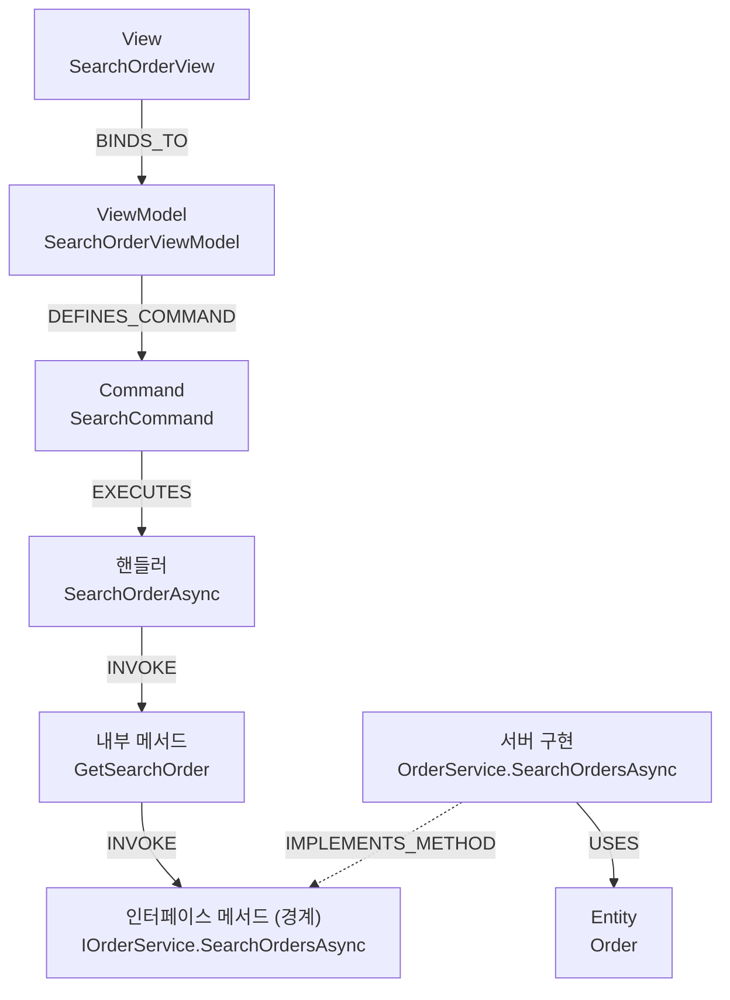

# SearchOrderView → SearchCommand E2E 체인 추적

> 출처: Vanuatu 코드 지식 그래프(Neo4j) 질의 결과. 추출 기준선 2026-06-05(풀 커버리지).
> 추적 대상: `SearchOrderView`의 검색 버튼(`SearchCommand`)이 어떤 핸들러 → `IOrderService` → 어떤 엔티티까지 흐르는가.

## 요약

검색 버튼은 클라이언트 VM의 `SearchOrderAsync` → 내부 헬퍼 `GetSearchOrder`를 거쳐 공유 인터페이스 `IOrderService.SearchOrdersAsync`를 호출한다. 이 인터페이스 메서드를 서버의 `OrderService.SearchOrdersAsync`가 구현(`IMPLEMENTS_METHOD`)하며, 그 구현이 `Order` 엔티티를 사용(`USES`)한다. 클라이언트 WPF(`Shefa.Module.Order`)와 백엔드(`Torba.Service.Order`)는 공유 인터페이스 메서드 노드 하나로 봉합된다.

## 다이어그램



## 체인 상세 (네임스페이스 포함)

| 단계 | 노드 | 관계 |
|---|---|---|
| 1 | `Shefa.Module.Order.Views.SearchOrderView` | `BINDS_TO` ↓ |
| 2 | `Shefa.Module.Order.ViewModels.SearchOrderViewModel` | `DEFINES_COMMAND` ↓ |
| 3 | `…SearchOrderViewModel.SearchCommand` | `EXECUTES` ↓ |
| 4 | `…SearchOrderViewModel.SearchOrderAsync` (핸들러) | `INVOKE` ↓ |
| 5 | `…SearchOrderViewModel.GetSearchOrder` (내부 헬퍼) | `INVOKE` ↓ |
| 6 | **`Vanuatu.Service.Order.IOrderService.SearchOrdersAsync`** (경계 인터페이스) | `IMPLEMENTS_METHOD` ↑ |
| 7 | `Torba.Service.Order.OrderService.SearchOrdersAsync` (서버 구현) | `USES` ↓ |
| 8 | **`Order`** (Entity) | — |

## 분석 메모

- 핸들러(`SearchOrderAsync`)가 인터페이스를 **직접 호출하지 않고** VM 내부 헬퍼 `GetSearchOrder`를 한 번 경유(2-hop)한다. 그래프 추적에서만 드러나는 간접 경로다.
- 최종적으로 닿는 DB 엔티티는 `Order` 한 개다.
- `SearchOrderViewModel`은 검색 외에도 `ChangePageCommand`/`EditCommand`/`ExportExcelCommand`/`ResetCommand`/`ShowOrderDetailsCommand`/`DoubleClickCommand`를 가지지만, 본 추적은 `SearchCommand` 경로만 다룬다.

## 재현용 Cypher

```cypher
// 1) View → VM → Command → 핸들러
MATCH (v:View {name:'SearchOrderView'})-[:BINDS_TO]->(vm:ViewModel)
MATCH (vm)-[:DEFINES_COMMAND]->(cmd:Command {name:'SearchCommand'})-[:EXECUTES]->(h:Method)
RETURN vm.name, cmd.name, h.fullName;

// 2) 핸들러 → (경유) → 인터페이스 메서드 경로 추적
MATCH p = (h:Method {fullName:'Shefa.Module.Order.ViewModels.SearchOrderViewModel.SearchOrderAsync'})
          -[:INVOKE*1..4]->(im:Method {fullName:'Vanuatu.Service.Order.IOrderService.SearchOrdersAsync'})
RETURN [n IN nodes(p) | n.fullName] AS chain, length(p) AS hops ORDER BY hops LIMIT 1;

// 3) 인터페이스 ← 서버 구현 → 엔티티 (경계 관통)
MATCH (im:Method {fullName:'Vanuatu.Service.Order.IOrderService.SearchOrdersAsync'})
      <-[:IMPLEMENTS_METHOD]-(impl:Method)-[:USES]->(e:Entity)
RETURN impl.fullName, e.name;
```
