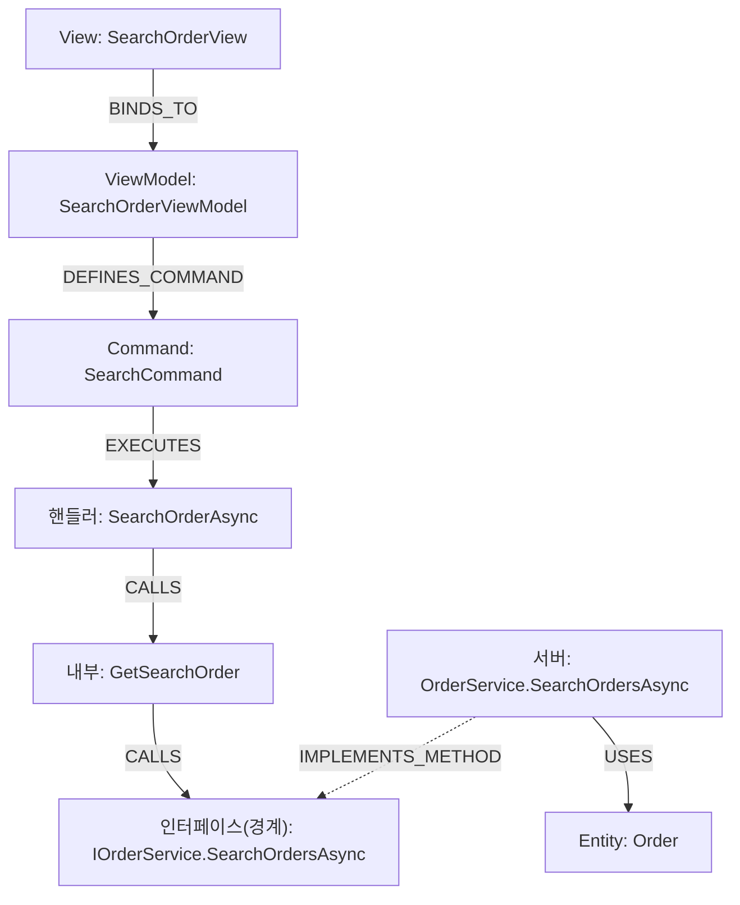

# CodeWiki 쿡북 — Neo4j 이해 + 검증 Cypher + Browser 내비게이션

> CodeWiki 그래프를 **직접 질의·탐색**하기 위한 단일 문서. 세 용도를 한 번에 담는다.
> 1) **LLM 주입용** — `mcp-neo4j-cypher`로 질의하는 LLM의 컨텍스트로 §2~§4를 제공.
> 2) **사람이 직접** — Neo4j Browser에서 손으로 쿼리·내비게이션(§1 학습 + §5 가이드).
> 3) **Markdown 생성** — §6 워크드 예제가 출력 형식의 본보기.
>
> 스키마 정본은 [codewiki-spec.md](codewiki-spec.md) §6. 이 문서는 그 스키마를 *쓰는 법*이다.
> **이 문서의 모든 Cypher·식별자·수치는 Vanuatu.sln 실측 그래프(21,300 노드 / 72,522 엣지 / 42 프로젝트)로 검증됨.**

---

## 1. Neo4j를 SQL·ER로 이해하기 (RDB 개발자용)

> **한 문장:** Neo4j는 "JOIN을 미리 해둔 데이터베이스"다. 외래키로 매번 조인하던 것을, **관계(화살표)를 디스크에 물리적으로 저장**해 포인터 따라가듯 순회한다. 그래서 "호출→호출→구현→…" 다단계 추적이 재귀 CTE 없이 자연스럽다. 이 그래프는 곧 **C# 코드의 살아있는 ER 다이어그램**이다.

### 1.1 관계형 → 그래프 1:1 번역

| 관계형 (MS SQL / ER) | Neo4j | 이 프로젝트의 예 |
|---|---|---|
| 테이블 | **노드 라벨** | `(:Method)`, `(:Class)` |
| 행(row) | **노드** | 메서드 하나 = 노드 하나 |
| 컬럼(스칼라) | **노드 프로퍼티** | `m.name`, `m.fullName`, `m.pk` |
| 기본키 | 프로퍼티(+인덱스) | `pk` (FNV-1a 해시) |
| 외래키 / 다대다 조인테이블 | **관계(엣지)** | `(a)-[:CALLS]->(b)` |
| JOIN | **패턴 매칭/순회** | `(a)-[:CALLS]->(b)` |
| 조인테이블의 추가 컬럼 | **관계 프로퍼티** | (코어 ETL엔 드묾; Phase 2에서 추가) |
| 재귀 CTE | **가변 길이 경로** | `-[:CALLS*1..4]->` |
| `WHERE`/`ORDER BY`/`DISTINCT` | 거의 동일 | — |

**핵심 차이 둘:**
1. **관계가 1급 시민.** "A가 B를 호출"을 조인테이블+JOIN 없이 `(A)-[:CALLS]->(B)` 화살표로 *저장*한다.
2. **스키마-옵셔널.** `CREATE TABLE` 없이 노드마다 프로퍼티가 달라도 됨(`:Method`엔 `arguments`/`returnType`, `:File`엔 없음). "이 노드에 무슨 프로퍼티?"는 [spec §6](codewiki-spec.md)·이 쿡북을 보거나 `CALL db.schema.visualization()`.

### 1.2 SQL ↔ Cypher 나란히

**"OrderService가 가진 메서드"** — 조인 조건이 사라지고 관계가 대신한다.
```sql
SELECT m.Name FROM Method m JOIN [Class] c ON c.Id=m.ClassId WHERE c.Name='OrderService';
```
```cypher
MATCH (c:Class {name:"OrderService"})-[:DECLARES]->(m:Method) RETURN m.name;
```

**"호출 체인 4단계"** — 재귀 CTE가 세 글자(`*1..4`)로.
```sql
WITH CallChain AS (
  SELECT CallerId,CalleeId,1 d FROM Invoke WHERE CallerId=@start
  UNION ALL SELECT i.CallerId,i.CalleeId,cc.d+1 FROM Invoke i JOIN CallChain cc ON i.CallerId=cc.CalleeId WHERE cc.d<4)
SELECT DISTINCT CalleeId FROM CallChain;
```
```cypher
MATCH (h:Method {name:"SearchOrderAsync"})-[:CALLS*1..4]->(t:Method) RETURN DISTINCT t.fullName;
```

### 1.3 빠른 참조 (SQL 대조)

| 하고 싶은 것 | SQL | Cypher |
|---|---|---|
| 조회 | `SELECT * FROM Method` | `MATCH (m:Method) RETURN m` |
| 조건 | `WHERE name='X'` | `WHERE m.name='X'` 또는 `{name:'X'}` |
| 조인 | `JOIN ... ON` | `(a)-[:REL]->(b)` 패턴 |
| 외부조인 | `LEFT JOIN` | `OPTIONAL MATCH` |
| 상위 N | `TOP 10` | `LIMIT 10` (`SKIP n LIMIT m`) |
| 집계 | `COUNT(*) ... GROUP BY` | `count(*)` (비집계 키가 암시적 그룹) |
| 존재 카운트 | `(SELECT COUNT(*) ...)` 상관 서브쿼리 | `count{ (n)-[:REL]->() }` 패턴 카운트 |
| UPSERT | `MERGE` | `MERGE` |
| 배치입력 | TVP `@batch` | `UNWIND $batch AS row` |
| 재귀 | 재귀 CTE | `-[:REL*1..n]->` |
| 메타확인 | `INFORMATION_SCHEMA` | `db.labels()`, `db.schema.visualization()` |

> **암시적 GROUP BY:** Cypher엔 `GROUP BY`가 없다. `RETURN c.name, count(m)`이면 비집계 `c.name`이 자동 그룹 키.

---

## 2. 스키마 요약 (질의용)

전체 정의는 [spec §6](codewiki-spec.md). 질의에 필요한 만큼만. **숫자는 Vanuatu 실측 노드 수.**

**구조 라벨(1차):** `Method`(12,979) `Class`(3,358) `File`(2,945) `Command`(1,204) `Package`(532) `Interface`(239) `Project`(42) `Solution`(1)
**역할 라벨(2차, 다중):** `DTO`(563) `ViewModel`(499) `Entity`(378) `View`(355) `Repository`(139) `Service`(51) `Controller`(36) — 예 `(:Class:ViewModel)`, `(:Class:Service)`.
**공통 프로퍼티:** `pk`(FNV-1a 식별키·인덱스) · `name`(짧은 이름) · `fullName`(정규화 전체 이름). `Method`는 `arguments`/`returnType`도 가짐(오버로드 구분).

> **공유 `:Node` 라벨:** 모든 노드는 `:Node` 라벨도 함께 갖는다(엣지 적재용 단일 인덱스). 질의는 의미 라벨(`:Method` 등)로 시작하면 된다.
> **`Folder` 라벨은 미사용:** 정의돼 있으나 추출 산출물엔 폴더 노드가 없다. 파일시스템 입자는 `:File`까지.

**네임스페이스 규약(경계 식별의 핵심):**
- **클라이언트 WPF** — `Shefa.*` (모듈·뷰·뷰모델, 약 1,211 타입). REST 프록시는 `Shefa.Service.RestAPI.*`.
- **서버 서비스 구현** — `Torba.Service.*` (예: `Torba.Service.Order.OrderService`, 38 타입). 서버 끝단 필터는 `WHERE impl.fullName STARTS WITH 'Torba.Service'`.

| 엣지 | 방향 A→B | 의미 | 실측 수 |
|---|---|---|---:|
| `CALLS` | Method → Method | 메서드 호출 | 21,311 |
| `DEPENDS_ON` | Project → Project | 프로젝트 참조 | 12,319 |
| `DECLARES` | Type → Method | 타입이 메서드 보유 | 10,512 |
| `INSTANTIATES` | Method → Class | 객체 생성(`new`, target-typed `new()` 포함) | 6,711 |
| `USES_TYPE` | Method → Type | 파라미터/반환/필드 타입 (영향도) | 5,039 |
| `IMPLEMENTS_METHOD` | Method(구현) → Method(인터페이스) | **경계 관통 허브** | 4,380 |
| `DECLARED_IN` | Type → File | 선언 위치 | 3,089 |
| `INCLUDED_IN` | File → Project | 파일 소속 | 2,947 |
| `IMPLEMENTS` | Class → Interface | 타입 레벨 인터페이스 구현 | 1,366 |
| `DEFINES_COMMAND` | ViewModel → Command | VM이 Command 보유 | 1,204 |
| `EXECUTES` | Command → Method | 핸들러(`new DelegateCommand(H)`) | 1,204 |
| `INHERITS` | Class → Class | 베이스 클래스 상속 | 1,104 |
| `USES` | Method → Entity | 서버 메서드가 `IRepository<T>`로 만지는 엔티티 | 940 |
| `BINDS_TO` | View → ViewModel | Prism 네이밍 | 354 |
| `CONTAINS` | Solution → Project | 솔루션 구성 | 42 |

---

## 3. 🔑 경계 관통 패턴 (가장 중요)

클라이언트 WPF(`Shefa.*`)와 백엔드(`Torba.Service.*`)는 **공유 인터페이스 메서드 노드**로 봉합된다. WPF 핸들러는 `IService` 타입 필드로 호출하므로 `CALLS`가 인터페이스 메서드로 **직행**하고, 클라 프록시·서버 서비스가 그 멤버를 `IMPLEMENTS_METHOD`로 구현 → 인터페이스 `Method`가 다리.

```
[Shefa 핸들러] --CALLS--> [I*Service.M (인터페이스 메서드 = 허브)] <--IMPLEMENTS_METHOD-- [Torba.Service 구현] --USES--> [Entity]
```

```cypher
// 핸들러 →(호출)→ 인터페이스 메서드 ←(구현)← 서버 서비스 →(USES)→ 엔티티
MATCH (h:Method)-[:CALLS]->(im:Method)<-[:IMPLEMENTS_METHOD]-(impl:Method)
WHERE impl.fullName STARTS WITH 'Torba.Service'
MATCH (impl)-[:USES]->(e:Entity)
RETURN h.fullName, im.name, impl.fullName, e.name LIMIT 10;
```

> **왜 `im`이 둘로 보이나:** 같은 인터페이스를 클라 프록시와 서버가 **둘 다** `IMPLEMENTS_METHOD`로 구현한다. 서버 끝단만 원하면 `STARTS WITH 'Torba.Service'`로 좁힌다.

---

## 4. 활용 사례별 검증 Cypher

> **레시피 인덱스** — ① 타입 영향도 · ② 화면→DB E2E · ③ VM 도시에(목적 #2) · ④ 역추적(엔티티→화면) · ⑤ 엔티티/DTO 핫스팟 · ⑥ 미연결 커맨드 진단 · ⑦ 서비스 인벤토리 · ⑧ 호출 트리 · ⑨ 프로젝트 순환 의존 · ⑩ 연결성 검증

### ① DTO/타입 변경 영향도 (누락 없는 상위집합)
```cypher
MATCH (m:Method)-[:USES_TYPE]->(t {name:$typeName})     // 예: 'OrderDTO'
OPTIONAL MATCH (owner)-[:DECLARES]->(m)
RETURN labels(owner) AS ownerKind, owner.name AS owner, m.name AS method ORDER BY owner;
```
실측: `OrderDTO`는 37개 메서드가 직접 참조, `CustomerDTO` 26, `EmployeeDTO` 20.

### ② 화면 → DB E2E 추적 (단일 체인) — 목적 #2·#3의 뼈대
```cypher
MATCH (v:View {name:$viewName})-[:BINDS_TO]->(vm:ViewModel)
MATCH (vm)-[:DEFINES_COMMAND]->(cmd:Command)-[:EXECUTES]->(h:Method)
MATCH (h)-[:CALLS*1..4]->(im:Method)<-[:IMPLEMENTS_METHOD]-(impl:Method)
WHERE impl.fullName STARTS WITH 'Torba.Service'
MATCH (impl)-[:USES]->(e:Entity)
RETURN v.name, vm.name, cmd.name, h.name, im.name, impl.fullName, e.name;
```
> Mermaid가 필요하면 결과를 `graph TD` 체인으로 변환(예시 §6-A).

### ③ 🎯 ViewModel 도시에 — 한 화면의 모든 커맨드와 서버 도달점 (목적 #2 핵심)
"`SearchOrderViewModel`을 고르면 이 VM의 모든 커맨드와, 각 커맨드가 닿는 서버 구현을 한 번에."
```cypher
MATCH (vm:ViewModel {name:$vmName})-[:DEFINES_COMMAND]->(c:Command)
OPTIONAL MATCH (c)-[:EXECUTES]->(h:Method)-[:CALLS*1..4]->(im:Method)
              <-[:IMPLEMENTS_METHOD]-(impl:Method)
WHERE impl.fullName STARTS WITH 'Torba.Service'
RETURN c.name AS command,
       collect(DISTINCT im.name)   AS 인터페이스메서드,
       collect(DISTINCT impl.fullName) AS 서버구현
ORDER BY command;
```
실측(`SearchOrderViewModel`, 커맨드 7개):

| command | 인터페이스메서드 | 서버구현 |
|---|---|---|
| `SearchCommand` | `SearchOrdersAsync` | `Torba.Service.Order.OrderService.SearchOrdersAsync` |
| `ExportExcelCommand` | `SearchOrdersAsync` | `…OrderService.SearchOrdersAsync` |
| `ChangePageCommand` | `SearchOrdersAsync` | `…OrderService.SearchOrdersAsync` |
| `ShowOrderDetailsCommand` | `GetOrderAsync`, `GetOrderItemsAsync` | `…OrderService.GetOrderAsync` / `…GetOrderItemsAsync` |
| `EditCommand` / `ResetCommand` / `DoubleClickCommand` | (없음 — 순수 UI 동작) | — |

> 빈 행은 서버를 안 거치는 클라 전용 커맨드. 진단은 §4-⑥.

### ④ 역추적 — 엔티티에서 화면으로 (DB → 화면)
"`Order` 테이블을 만지는 화면이 어디인가?" 영향도를 **DB 쪽에서** 거꾸로.
```cypher
MATCH (e:Entity {name:$entityName})<-[:USES]-(impl:Method)
WHERE impl.fullName STARTS WITH 'Torba.Service'
MATCH (impl)-[:IMPLEMENTS_METHOD]->(im:Method)<-[:CALLS*1..4]-(h:Method)
MATCH (vm:ViewModel)-[:DEFINES_COMMAND]->(c:Command)-[:EXECUTES]->(h)
RETURN DISTINCT vm.name AS viewModel, c.name AS command ORDER BY viewModel, command;
```

### ⑤ 엔티티/DTO 핫스팟 (가장 많이 만지는 모델)
```cypher
// 서버 메서드가 가장 많이 USES 하는 엔티티
MATCH (impl:Method)-[:USES]->(e:Entity) WHERE impl.fullName STARTS WITH 'Torba.Service'
RETURN e.name AS entity, count(DISTINCT impl) AS serverMethods ORDER BY serverMethods DESC LIMIT 12;
```
실측 상위: `Order`(104) · `OrderPV`(63) · `PV`(62) · `Customer`(30) · `Invoice`(20) · `Payment`(20). → 변경 위험이 가장 큰 도메인 핵심.

### ⑥ 미연결 커맨드 진단 (서버 미도달 9.6%)
```cypher
MATCH (vm:ViewModel)-[:DEFINES_COMMAND]->(c:Command)-[:EXECUTES]->(h:Method)
WHERE NOT (h)-[:CALLS*1..4]->(:Method)<-[:IMPLEMENTS_METHOD]-(:Method)
RETURN vm.name AS viewModel, c.name AS command ORDER BY viewModel LIMIT 30;
```
> 인터페이스 허브에 안 닿는 커맨드(전체의 9.6%). 대개 순수 UI(`Reset`/`DoubleClick`)거나 5홉↑ 또는 사각지대(§7). "버그"가 아니라 분류 출발점.

### ⑦ 서비스 인벤토리 — 클라 REST 프록시 ↔ 서버 구현
같은 인터페이스 메서드를 **양쪽 네임스페이스가 다 구현**하는 것만(보일러플레이트 `Connect`/`InitializeComponent` 제외).
```cypher
MATCH (im:Method)<-[:IMPLEMENTS_METHOD]-(impl:Method)
WITH im,
     [x IN collect(DISTINCT impl.fullName) WHERE x STARTS WITH 'Torba.Service']        AS server,
     [x IN collect(DISTINCT impl.fullName) WHERE x STARTS WITH 'Shefa.Service.RestAPI'] AS client
WHERE size(server) > 0 AND size(client) > 0
RETURN im.name AS 인터페이스메서드, client[0] AS 클라프록시, server[0] AS 서버구현
ORDER BY 인터페이스메서드 LIMIT 20;
```
> 클라 REST 프록시(`Shefa.Service.RestAPI.*`)와 서버(`Torba.Service.*`)가 같은 멤버를 구현 → 경계가 봉합된 증거. 예: `IShippingService.AddAddressCorrectionAsync`를 `Shefa.Service.RestAPI.ShippingService`와 `Torba.Service.Shipping.ShippingService`가 각각 구현.

### ⑧ 한 메서드의 호출 트리 (정·역방향)
```cypher
// 순방향: 이 핸들러가 부르는 모든 것
MATCH p=(h:Method {name:$method})-[:CALLS*1..3]->(t:Method)
RETURN [n IN nodes(p) | n.name] AS chain LIMIT 25;
// 역방향: 이 메서드를 부르는 모든 호출자 (영향도)
MATCH (caller:Method)-[:CALLS]->(m:Method {name:$method})
RETURN DISTINCT caller.fullName ORDER BY caller.fullName;
```

### ⑨ 프로젝트 순환 의존
```cypher
MATCH path=(p:Project)-[:DEPENDS_ON*2..]->(p) RETURN [n IN nodes(path)|n.name] AS cycle LIMIT 20;
```

### ⑩ 연결성 검증 (완료 기준) — 커맨드가 백엔드 허브에 닿는 비율
```cypher
MATCH (c:Command)-[:EXECUTES]->(h:Method)
OPTIONAL MATCH (h)-[:CALLS*1..4]->(im:Method)<-[:IMPLEMENTS_METHOD]-(:Method)
WITH c, count(im) AS reach
RETURN sum(CASE WHEN reach>0 THEN 1 ELSE 0 END) AS reachHub, count(c) AS total,
       round(100.0*sum(CASE WHEN reach>0 THEN 1 ELSE 0 END)/count(c),1) AS pct;
```
실측: **1,088 / 1,204 = 90.4%** 가 인터페이스 허브에 도달(나머지는 §4-⑥). 서버 구현+엔티티까지 끝단 도달은 56.0%.

---

## 5. Neo4j Browser 직접 내비게이션 (목적 #2)

`http://localhost:7474` (SSMS 쿼리 창에 해당). 결과를 **그래프로 시각화**하므로 화살표를 눈으로 따라가기 좋다.

> **⚠️ 그래프로 그려지려면 노드·관계·경로를 RETURN해야 한다.** Browser는 무엇을 반환했는지로 표현을 정한다:
> | RETURN | 결과 |
> |---|---|
> | `n.name` · 리스트 · 스칼라 (예: `[n IN nodes(p)\|n.name]`) | **Table만** (← 버그 아님) |
> | `n`(노드) · `r`(관계) · `p`(경로) | **그래프 캔버스** |
>
> 즉 `RETURN vm.name, [n IN nodes(p)\|n.name]`은 의도대로 표만 나온다. 눈으로 따라가려면 `RETURN p`(경로 통째)나 `RETURN v, vm, cmd, p, impl, e`처럼 **노드·경로 자체**를 반환하라.

1. **ER부터:** `CALL db.schema.visualization()` — 라벨/관계 메타 그래프.
2. **시작점 띄우기:** `MATCH (vm:ViewModel {name:'SearchOrderViewModel'}) RETURN vm` → 노드가 캔버스에 뜸.
3. **클릭-확장:** 노드를 더블클릭하면 인접 관계가 펼쳐진다. `DEFINES_COMMAND`→Command→`EXECUTES`→핸들러→`CALLS`→인터페이스 메서드(허브)→`IMPLEMENTS_METHOD`로 서버 서비스→`USES`→Entity까지 손으로 걸어간다.
4. **한 VM의 커맨드 전부 한 화면에:** §4-③ 쿼리를 `RETURN` 대신 경로로 바꿔 시각화.
   ```cypher
   MATCH p=(vm:ViewModel {name:'SearchOrderViewModel'})-[:DEFINES_COMMAND]->(:Command)
            -[:EXECUTES]->(:Method)-[:CALLS*1..4]->(:Method)<-[:IMPLEMENTS_METHOD]-(impl:Method)
   WHERE impl.fullName STARTS WITH 'Torba.Service'
   RETURN p LIMIT 50;
   ```
5. **E2E 체인 통째로:** §4-② 쿼리를 그대로 실행하면 경로가 통째로 시각화됨. 종착 Entity 노드(예: `Order`)가 DB 종착점.

> 화살표 방향: `(im)<-[:IMPLEMENTS_METHOD]-(impl)`는 화살표가 왼쪽을 향함 = "impl이 im을 구현". 방향만 맞으면 어느 쪽으로 그려도 매칭된다.
> **Browser 설정 팁:** 우측 톱니 → "Connect result nodes"를 켜면 경로 쿼리가 아니어도 결과 노드 간 관계가 자동으로 그려진다. "Initial Node Display"를 늘리면 큰 결과도 다 보인다.

---

## 6. 워크드 예제 (출력 본보기)

### 예제 A — SearchOrderView E2E 체인 (검증됨)

검색 버튼은 VM `SearchOrderAsync` → 내부 헬퍼 `GetSearchOrder`(2-hop) → 공유 인터페이스 `IOrderService.SearchOrdersAsync`를 호출. 서버 `Torba.Service.Order.OrderService.SearchOrdersAsync`가 구현하며 `Order` 엔티티를 사용. 클라(`Shefa.*`)와 백엔드(`Torba.Service.Order`)가 인터페이스 메서드 하나로 봉합.

**실측 체인:** `SearchOrderAsync → GetSearchOrder → SearchOrdersAsync → (IMPLEMENTS_METHOD) → Order`



재현 Cypher:
```cypher
MATCH (v:View {name:'SearchOrderView'})-[:BINDS_TO]->(vm:ViewModel)
MATCH (vm)-[:DEFINES_COMMAND]->(cmd:Command {name:'SearchCommand'})-[:EXECUTES]->(h:Method)
MATCH p=(h)-[:CALLS*1..4]->(im:Method {name:'SearchOrdersAsync'})
        <-[:IMPLEMENTS_METHOD]-(impl:Method)-[:USES]->(e:Entity)
WHERE impl.fullName STARTS WITH 'Torba.Service'
RETURN vm.name, cmd.name, [n IN nodes(p)|n.name] AS chain, impl.fullName, e.name;
```

### 예제 B — ViewModel 도시에 (목적 #2의 산출 본보기)

"`SearchOrderViewModel`을 선택했다. 이 화면이 할 수 있는 일과 각 동작이 닿는 서버·테이블을 보여줘." → §4-③ 쿼리 결과를 표로:

| 커맨드 | 하는 일(서버 메서드) | 종착 엔티티 |
|---|---|---|
| `SearchCommand` | `OrderService.SearchOrdersAsync` | `Order` |
| `ExportExcelCommand` | `OrderService.SearchOrdersAsync` (같은 조회 후 엑셀) | `Order` |
| `ChangePageCommand` | `OrderService.SearchOrdersAsync` (페이징 재조회) | `Order` |
| `ShowOrderDetailsCommand` | `OrderService.GetOrderAsync`, `GetOrderItemsAsync` | `Order` |
| `EditCommand`·`ResetCommand`·`DoubleClickCommand` | 서버 미경유(순수 UI) | — |

> 이 표가 곧 "화면 한 장의 기능 명세"다. LLM은 여기에 소스 스니펫(Phase 2)·Mermaid를 덧붙여 Markdown 위키 페이지를 생성.

### 예제 C — 타입 변경 영향도 (OrderDTO)

`OrderDTO` 타입을 바꾸면: **1차**(시그니처 직접 사용) — 37개 메서드가 파라미터/반환으로 직접 참조(클라/서버 양쪽). **2차**(호출 전파) — 그 메서드들을 부르는 상위 호출자. 클라/서버가 같은 인터페이스를 구현하므로 경계 양쪽이 함께 영향.

```cypher
// 1차: 직접 참조
MATCH (m:Method)-[:USES_TYPE]->(t {name:'OrderDTO'})
OPTIONAL MATCH (owner)-[:DECLARES]->(m)
RETURN labels(owner) AS kind, owner.fullName AS owner, m.fullName AS method ORDER BY owner;
// 2차: 호출 전파 (1차 메서드를 부르는 호출자)
MATCH (m:Method)-[:USES_TYPE]->(t {name:'OrderDTO'})
MATCH (caller:Method)-[:CALLS]->(m)
RETURN DISTINCT caller.fullName, collect(DISTINCT m.name) AS calls ORDER BY caller.fullName;
```

### 예제 D — 엔티티 역추적 (Order를 만지는 화면 전부)

"`Order` 테이블이 바뀌면 어떤 화면을 회귀 테스트해야 하나?" → §4-④ 쿼리로 DB에서 화면 방향으로 거슬러 올라가 ViewModel·Command 목록을 얻는다. 핫스팟(`Order`=서버 메서드 104개, §4-⑤)일수록 영향 반경이 넓다.

---

## 7. ⚠️ 질의 시 유의 (그래프의 한계)

1. **타입 레벨 영향도:** `USES_TYPE`는 파라미터/반환/필드 타입을 잡는다(상위집합 — 누락보다 과검출이 안전). 최종 확인은 컴파일러로.
2. **DI 그래프 없음:** `REGISTERS`는 비목표(사용자가 DI 직접 관리). 경계 봉합은 `IMPLEMENTS_METHOD` 허브로 충분.
3. **라우트 문자열 경계 미구현:** 경계 관통은 `IMPLEMENTS_METHOD`로만. HTTP 경로 매칭은 비목표.
4. **끝단은 Entity까지:** `USES`는 `Repository<T>`의 `T`(엔티티)까지. DbContext·물리 테이블명은 비목표.
5. **이름 충돌:** `name`은 짧아 동명 가능(서비스가 클라/서버로 2개씩 보이는 이유). 정밀 식별은 `fullName`/`pk`.
6. **빈 결과 ≠ 코드에 없음:** 빌드 실패 모듈 등 커버리지 한계([spec §9](codewiki-spec.md) 불변식)부터 의심. `MATCH (n) RETURN n` 전체 스캔 금지 — 라벨·프로퍼티로 시작점을 좁혀라.
7. **`CallRawSQL`(raw SQL)·`DTOGenerator` 산출물은 사각지대**(비목표).
8. **`Folder` 라벨 미사용:** 파일시스템 입자는 `:File`까지만 존재.
