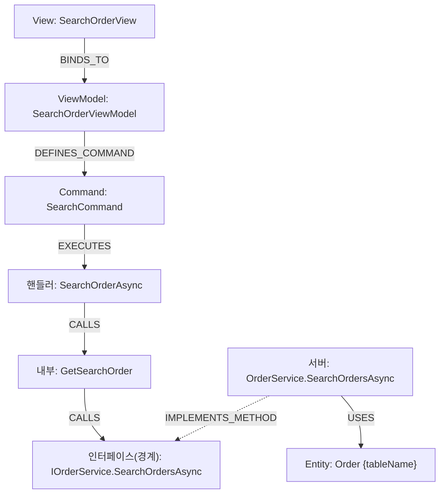

# CodeWiki 쿡북 — Neo4j 이해 + 검증 Cypher + Browser 내비게이션

> CodeWiki 그래프를 **직접 질의·탐색**하기 위한 단일 문서. 세 용도를 한 번에 담는다.
> 1) **LLM 주입용** — `mcp-neo4j-cypher`로 질의하는 LLM의 컨텍스트로 §2~§4를 제공.
> 2) **사람이 직접** — Neo4j Browser에서 손으로 쿼리·내비게이션(§1 학습 + §5 가이드).
> 3) **Markdown 생성** — §6 워크드 예제가 출력 형식의 본보기.
>
> 스키마 정본은 [codewiki-spec.md](codewiki-spec.md) §6. 이 문서는 그 스키마를 *쓰는 법*이다.

---

## 1. Neo4j를 SQL·ER로 이해하기 (RDB 개발자용)

> **한 문장:** Neo4j는 "JOIN을 미리 해둔 데이터베이스"다. 외래키로 매번 조인하던 것을, **관계(화살표)를 디스크에 물리적으로 저장**해 포인터 따라가듯 순회한다. 그래서 "호출→호출→구현→…" 다단계 추적이 재귀 CTE 없이 자연스럽다. 이 그래프는 곧 **C# 코드의 살아있는 ER 다이어그램**이다.

### 1.1 관계형 → 그래프 1:1 번역

| 관계형 (MS SQL / ER) | Neo4j | 이 프로젝트의 예 |
|---|---|---|
| 테이블 | **노드 라벨** | `(:Method)`, `(:Class)` |
| 행(row) | **노드** | 메서드 하나 = 노드 하나 |
| 컬럼(스칼라) | **노드 프로퍼티** | `m.name`, `m.fullName`, `m.pk` |
| 기본키 | 프로퍼티(+제약) | `pk` (FNV-1a 해시) |
| 외래키 / 다대다 조인테이블 | **관계(엣지)** | `(a)-[:CALLS]->(b)` |
| JOIN | **패턴 매칭/순회** | `(a)-[:CALLS]->(b)` |
| 조인테이블의 추가 컬럼 | **관계 프로퍼티** | `REGISTERS`의 `lifetime` |
| 재귀 CTE | **가변 길이 경로** | `-[:CALLS*1..4]->` |
| `WHERE`/`ORDER BY`/`DISTINCT` | 거의 동일 | — |

**핵심 차이 둘:**
1. **관계가 1급 시민.** "A가 B를 호출"을 조인테이블+JOIN 없이 `(A)-[:CALLS]->(B)` 화살표로 *저장*한다.
2. **스키마-옵셔널.** `CREATE TABLE` 없이 노드마다 프로퍼티가 달라도 됨(`:Method`엔 `arguments`/`returnType`, `:Folder`엔 없음). "이 노드에 무슨 프로퍼티?"는 [spec §6](codewiki-spec.md)·이 쿡북을 보거나 `CALL db.schema.visualization()`.

### 1.2 SQL ↔ Cypher 나란히

**"OrderService가 가진 메서드"** — 조인 조건이 사라지고 관계가 대신한다.
```sql
SELECT m.Name FROM Method m JOIN [Class] c ON c.Id=m.ClassId WHERE c.Name='OrderService';
```
```cypher
MATCH (c:Class {name:"OrderService"})-[:DECLARES]->(m:Method) RETURN m.name;
```

**"호출 체인 4단계"** — 재귀 CTE가 세 글자(`*1..4`)로.
```sql
WITH CallChain AS (
  SELECT CallerId,CalleeId,1 d FROM Invoke WHERE CallerId=@start
  UNION ALL SELECT i.CallerId,i.CalleeId,cc.d+1 FROM Invoke i JOIN CallChain cc ON i.CallerId=cc.CalleeId WHERE cc.d<4)
SELECT DISTINCT CalleeId FROM CallChain;
```
```cypher
MATCH (h:Method {name:"ExecuteSearch"})-[:CALLS*1..4]->(t:Method) RETURN DISTINCT t.fullName;
```

### 1.3 빠른 참조 (SQL 대조)

| 하고 싶은 것 | SQL | Cypher |
|---|---|---|
| 조회 | `SELECT * FROM Method` | `MATCH (m:Method) RETURN m` |
| 조건 | `WHERE name='X'` | `WHERE m.name='X'` 또는 `{name:'X'}` |
| 조인 | `JOIN ... ON` | `(a)-[:REL]->(b)` 패턴 |
| 외부조인 | `LEFT JOIN` | `OPTIONAL MATCH` |
| 상위 N | `TOP 10` | `LIMIT 10` (`SKIP n LIMIT m`) |
| 집계 | `COUNT(*) ... GROUP BY` | `count(*)` (비집계 키가 암시적 그룹) |
| UPSERT | `MERGE` | `MERGE` |
| 배치입력 | TVP `@batch` | `UNWIND $batch AS row` |
| 재귀 | 재귀 CTE | `-[:REL*1..n]->` |
| 메타확인 | `INFORMATION_SCHEMA` | `db.labels()`, `db.schema.visualization()` |

> **암시적 GROUP BY:** Cypher엔 `GROUP BY`가 없다. `RETURN c.name, count(m)`이면 비집계 `c.name`이 자동 그룹 키.

---

## 2. 스키마 요약 (질의용)

전체 정의는 [spec §6](codewiki-spec.md). 질의에 필요한 만큼만:

**주 라벨:** `Method` `Class` `Interface` `Command` `File` `Folder` `Solution` `Project` `Package`
**역할 라벨(2차, 다중):** `ViewModel` `Controller` `Service` `Repository` `Entity` `DTO` `View` — 예 `(:Class:ViewModel)`.
**공통 프로퍼티:** `pk`(FNV-1a 식별키) · `name`(짧은 이름) · `fullName`(정규화 전체 이름). `Method`는 `arguments`/`returnType`도 가짐(오버로드 구분).

| 엣지 | 방향 A→B | 의미 |
|---|---|---|
| `BINDS_TO` | View → ViewModel | Prism 네이밍 |
| `DEFINES_COMMAND` | ViewModel → Command | VM이 Command 보유 |
| `EXECUTES` | Command → Method | 핸들러(`new DelegateCommand(H)`) |
| `CALLS` | Method → Method | 메서드 호출 |
| `IMPLEMENTS_METHOD` | Method(구현) → Method(인터페이스) | **경계 관통 허브** |
| `IMPLEMENTS` | Class → Interface | 타입 레벨 인터페이스 구현 |
| `INHERITS` | Class → Class | 베이스 클래스 상속 |
| `DECLARES` | Type → Method | 타입이 메서드 보유 |
| `INSTANTIATES` | Method → Class | 객체 생성(new) |
| `USES` | Method → Entity | 서버 메서드가 `IRepository<T>`로 만지는 엔티티 |
| `USES_TYPE` | Method → Type | 파라미터/반환/필드 타입 (영향도) |
| `REGISTERS` | Interface → Class | DI 등록, `lifetime`∈{Scoped,Singleton,Transient} |
| `DECLARED_IN` | Type → File | 선언 위치 |
| `INCLUDED_IN`/`CONTAINS`/`DEPENDS_ON` | — | 파일시스템·프로젝트 구조 |

---

## 3. 🔑 경계 관통 패턴 (가장 중요)

클라이언트 WPF와 백엔드는 **공유 인터페이스 메서드 노드**로 봉합된다. WPF 핸들러는 `IService` 타입 필드로 호출하므로 `CALLS`가 인터페이스 메서드로 **직행**하고, 클라 프록시·서버 서비스가 그 멤버를 `IMPLEMENTS_METHOD`로 구현 → 인터페이스 `Method`가 다리.

```cypher
// 핸들러 →(호출)→ 인터페이스 메서드 ←(구현)← 서버 서비스 →(USES)→ 엔티티
MATCH (h:Method)-[:CALLS]->(im:Method)<-[:IMPLEMENTS_METHOD]-(impl:Method)
MATCH (impl)-[:USES]->(e:Entity)
RETURN h.fullName, im.fullName, impl.fullName, e.name;
```

---

## 4. 활용 사례별 검증 Cypher (3대 목적)

### ① DTO/타입 변경 영향도 (누락 없는 상위집합)
```cypher
MATCH (m:Method)-[:USES_TYPE]->(t {name:$typeName})
OPTIONAL MATCH (owner)-[:DECLARES]->(m)
RETURN labels(owner) AS ownerKind, owner.name AS owner, m.name AS method ORDER BY owner;
```

### ② 화면 → DB E2E 추적 (단일 체인) — 목적 #2·#3의 뼈대
```cypher
MATCH (v:View {name:$viewName})-[:BINDS_TO]->(vm:ViewModel)
MATCH (vm)-[:DEFINES_COMMAND]->(cmd:Command)-[:EXECUTES]->(h:Method)
MATCH (h)-[:CALLS*1..4]->(im:Method)<-[:IMPLEMENTS_METHOD]-(impl:Method)
MATCH (impl)-[:USES]->(e:Entity)
RETURN v.name, vm.name, cmd.name, h.name, im.fullName, impl.fullName, e.name, e.tableName;
```
> Mermaid가 필요하면 결과를 `graph TD` 체인으로 변환(예시 §6).

### ③ DI 등록·순환 의존 (탐지는 Cypher가)
```cypher
MATCH (i:Interface)-[r:REGISTERS]->(impl:Class) RETURN i.name, impl.name, r.lifetime;
MATCH path=(p:Project)-[:DEPENDS_ON*2..]->(p) RETURN [n IN nodes(path)|n.name] AS cycle LIMIT 20;
```

### ④ 연결성 검증 (완료 기준 #1) — VM이 Entity까지 닿는가
```cypher
MATCH (vm:ViewModel)
OPTIONAL MATCH (vm)-[:DEFINES_COMMAND]->(:Command)-[:EXECUTES]->(:Method)
              -[:CALLS*1..4]->(:Method)<-[:IMPLEMENTS_METHOD]-(:Method)-[:USES]->(e:Entity)
WITH vm, count(e) AS reached
RETURN reached>0 AS connected, count(vm) AS vmCount ORDER BY connected;
```

---

## 5. Neo4j Browser 직접 내비게이션 (목적 #2)

`http://localhost:7474` (SSMS 쿼리 창에 해당). 결과를 **그래프로 시각화**하므로 화살표를 눈으로 따라가기 좋다.

1. **ER부터:** `CALL db.schema.visualization()` — 라벨/관계 메타 그래프.
2. **시작점 띄우기:** `MATCH (vm:ViewModel {name:'SearchOrderViewModel'}) RETURN vm` → 노드가 캔버스에 뜸.
3. **클릭-확장:** 노드를 더블클릭하면 인접 관계가 펼쳐진다. `DEFINES_COMMAND`→Command→`EXECUTES`→핸들러→`CALLS`→인터페이스 메서드(허브)→`IMPLEMENTS_METHOD`로 서버 서비스→`USES`→Entity까지 손으로 걸어간다.
4. **한 화면에 체인 전부:** §4-② 쿼리를 그대로 실행하면 경로가 통째로 시각화됨. Entity 노드를 클릭하면 `tableName` 속성이 보인다.

> 화살표 방향: `(im)<-[:IMPLEMENTS_METHOD]-(impl)`는 화살표가 왼쪽을 향함 = "impl이 im을 구현". 방향만 맞으면 어느 쪽으로 그려도 매칭된다.

---

## 6. 워크드 예제 (출력 본보기)

### 예제 A — SearchOrderView E2E 체인

검색 버튼은 VM `SearchOrderAsync` → 내부 헬퍼 `GetSearchOrder`(2-hop) → 공유 인터페이스 `IOrderService.SearchOrdersAsync`를 호출. 서버 `OrderService.SearchOrdersAsync`가 구현하며 `Order` 엔티티를 사용. 클라(`Shefa.Module.Order`)와 백엔드(`Torba.Service.Order`)가 인터페이스 메서드 하나로 봉합.



재현 Cypher:
```cypher
MATCH (v:View {name:'SearchOrderView'})-[:BINDS_TO]->(vm:ViewModel)
MATCH (vm)-[:DEFINES_COMMAND]->(cmd:Command {name:'SearchCommand'})-[:EXECUTES]->(h:Method)
MATCH p=(h)-[:CALLS*1..4]->(im:Method {name:'SearchOrdersAsync'})<-[:IMPLEMENTS_METHOD]-(impl:Method)
MATCH (impl)-[:USES]->(e:Entity)
RETURN vm.name, cmd.name, [n IN nodes(p)|n.name] AS chain, impl.fullName, e.name, e.tableName;
```

### 예제 B — 타입 변경 영향도 (SearchInvoiceFilter)

`SearchInvoiceFilter` 타입을 바꾸면: **1차**(시그니처 직접 사용) — `IPaymentService.SearchInvoiceAsync` + 클라/서버 `PaymentService` + `PaymentController.SearchInvoice` + VM 5개(`GenerateFilter`/`GetFilter` 등). **2차**(호출 전파) — `ExportCustomerInvoice`/`GetInvoices` 등 7개 상위 메서드. 클라/서버가 같은 인터페이스를 구현하므로 경계 양쪽이 함께 영향.

```cypher
// 1차: 직접 참조
MATCH (m:Method)-[:USES_TYPE]->(t {name:'SearchInvoiceFilter'})
OPTIONAL MATCH (owner)-[:DECLARES]->(m)
RETURN labels(owner) AS kind, owner.fullName AS owner, m.fullName AS method ORDER BY owner;
// 2차: 호출 전파
MATCH (m:Method)-[:USES_TYPE]->(t {name:'SearchInvoiceFilter'})
MATCH (caller:Method)-[:CALLS]->(m)
RETURN DISTINCT caller.fullName, collect(DISTINCT m.name) AS calls ORDER BY caller.fullName;
```

---

## 7. ⚠️ 질의 시 유의 (그래프의 한계)

1. **타입 레벨 영향도:** `USES_TYPE`는 파라미터/반환/필드 타입을 잡는다(상위집합 — 누락보다 과검출이 안전). 최종 확인은 컴파일러로.
2. **생성자 주입 DI 한계:** captive dependency(Singleton이 Scoped 주입) 완전 탐지는 `REGISTERS.lifetime` + `DEPENDS_ON` 수준까지만.
3. **라우트 문자열 경계(B) 미구현:** 경계 관통은 `IMPLEMENTS_METHOD`로만. HTTP 경로 매칭은 비목표.
4. **이름 충돌:** `name`은 짧아 동명 가능. 정밀 식별은 `fullName`/`pk`.
5. **빈 결과 ≠ 코드에 없음:** 빌드 실패 모듈 등 커버리지 한계([spec §9](codewiki-spec.md) 불변식)부터 의심. `MATCH (n) RETURN n` 전체 스캔 금지 — 라벨·프로퍼티로 시작점을 좁혀라.
6. **`CallRawSQL`(raw SQL)·`DTOGenerator` 산출물은 사각지대**(비목표).
