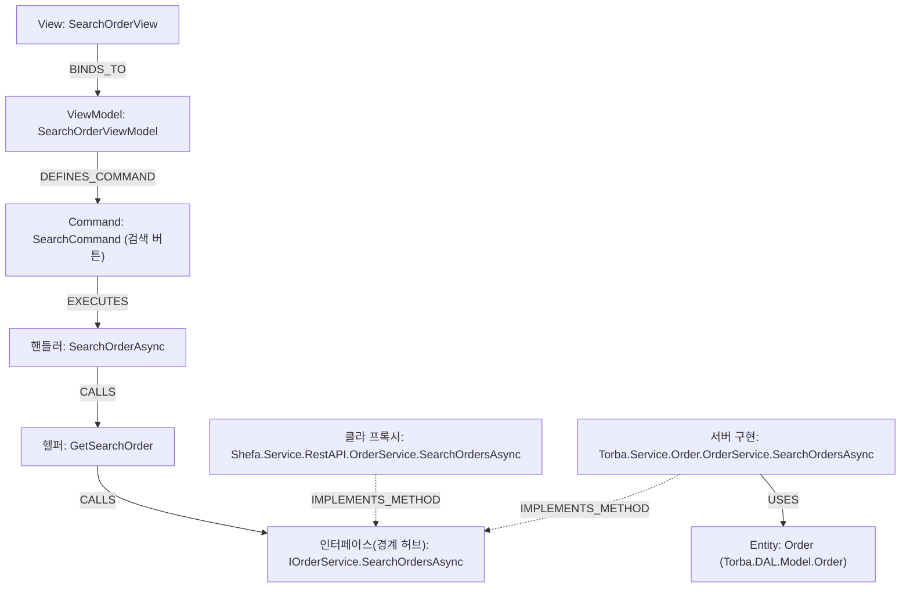

# SearchOrderView 검색 버튼 → DB E2E 추적

> 생성: CodeWiki 그래프(Vanuatu.sln) · 도구: mcp-neo4j-cypher · 결과물 유형: 화면→DB End-to-End

## 요약

`SearchOrderView`의 **검색 버튼**(`SearchCommand`)을 누르면, 핸들러 `SearchOrderViewModel.SearchOrderAsync`가
실행되어 VM 내부 헬퍼 `GetSearchOrder`를 거쳐 **경계 인터페이스** `IOrderService.SearchOrdersAsync`를 호출한다.
이 인터페이스 메서드는 클라이언트 REST 프록시(`Shefa.Service.RestAPI.OrderService`)와 서버 구현
(`Torba.Service.Order.OrderService`) 양쪽이 동시에 구현하는 **봉합점**이다. 실제 데이터에 닿는 서버 구현
`Torba.Service.Order.OrderService.SearchOrdersAsync`는 단일 엔티티 **`Order`**(`Torba.DAL.Model.Order`)를
조회한다. 즉 검색 버튼 한 번의 종착 엔티티는 **`Order` 하나**다.

## 다이어그램



## 상세

### 경로 단계

| # | 단계 | 노드 (`fullName`) | 역할 | 하는 일 (summary) |
|---|---|---|---|---|
| 1 | View | `Shefa.Module.Order.Views.SearchOrderView` | WPF 화면 | 주문 검색 화면 |
| 2 | ViewModel | `Shefa.Module.Order.ViewModels.SearchOrderViewModel` | 화면 로직 | 주문 목록을 검색·필터링·페이징하고 상세 조회, 편집, 엑셀 내보내기를 하는 화면 |
| 3 | Command | `SearchOrderViewModel.SearchCommand` | 검색 버튼 바인딩 | — |
| 4 | 핸들러 | `SearchOrderViewModel.SearchOrderAsync` | Command 실행자 | 현재 필터 조건으로 주문 목록을 처음 페이지부터 검색한다 |
| 5 | VM 헬퍼 | `SearchOrderViewModel.GetSearchOrder` | 검색 파라미터 구성/호출 | _(미enrich)_ |
| 6 | 인터페이스 | `Vanuatu.Service.Order.IOrderService.SearchOrdersAsync` | **경계 관통 허브** | 주어진 필터 조건에 따라 주문을 비동기로 검색하고 SearchOrderDTO 형태로 반환한다. _(claude-haiku-4-5)_ |
| 7 | 클라 프록시 | `Shefa.Service.RestAPI.OrderService.SearchOrdersAsync` | REST 호출 송신 | _(미enrich)_ |
| 8 | 서버 구현 | `Torba.Service.Order.OrderService.SearchOrdersAsync` | 서버 끝단(DB 접근) | _노드 자체는 `summary` 없음 → **6단계 인터페이스 요약이 곧 이 노드의 동작 설명**(enrich가 이 서버 구현 본문을 읽어 인터페이스 노드에 심음)_ |
| 9 | **Entity** | `Torba.DAL.Model.Order` | 종착 엔티티 | 주문 |

### 해석

- **검색 버튼의 종착 엔티티는 `Order` 하나다.** 서버 구현 `SearchOrdersAsync`가 `IRepository<T>`로
  만지는 엔티티(`USES`)를 모두 모아도 `Order` 단일이다.
- **경계는 인터페이스 메서드 `IOrderService.SearchOrdersAsync`가 봉합한다.** 같은 멤버를 클라 프록시
  (`Shefa.Service.RestAPI.OrderService`)와 서버(`Torba.Service.Order.OrderService`)가 둘 다
  `IMPLEMENTS_METHOD`로 구현 — WPF는 인터페이스로만 호출하고, 실제 DB 접근은 `Torba.Service` 쪽에서 일어난다.
- VM(`SearchOrderViewModel`)에는 검색 외에도 `EditCommand`, `ShowOrderDetailsCommand`, `ChangePageCommand`,
  `ExportExcelCommand`, `ResetCommand`, `DoubleClickCommand`가 있으나, 이 문서는 **검색 버튼 경로만** 다룬다.

### 의미(summary)는 인터페이스 노드에 모인다 — 설계 메모

`Vanuatu.Service.*`는 **인터페이스(계약)만** 갖고, 실제 구현은 `Torba.Service.*`(서버)에 있다. enrich는
이 구조를 반영해 다음처럼 동작한다:

1. **읽는 코드** = `Torba.Service.*`의 실제 서버 구현 본문 + 그 구현이 `CALLS`하는 서버 헬퍼들(클라
   프록시 `Shefa.Service.RestAPI.*`는 배제). → `Neo4jGraphReader.ReadIfaceUnitAsync`
2. **저장 위치** = 인터페이스(`im.pk`) 노드. → `IfaceEnricher` / `IfacePromptBuilder`("백엔드 서비스
   구현 코드를 읽고 그 의미를 요약한다")

그래서 **서버 구현(8단계) 노드의 `summary`는 비어 있어도, 그 동작 설명은 6단계 인터페이스 요약이 곧
그것**이다(같은 서버 코드를 읽어 만든 것). 경계 허브 한 곳에 의미를 모아두면, 클라/서버 어느 방향에서
그래프를 타고 와도 동일한 한 줄 정의를 만난다.

## 근거 Cypher

```cypher
-- 1) 시작점·VM·커맨드 확인
MATCH (v:View {name:'SearchOrderView'})-[:BINDS_TO]->(vm:ViewModel)
OPTIONAL MATCH (vm)-[:DEFINES_COMMAND]->(c:Command)
RETURN vm.fullName, vm.summary, collect(DISTINCT c.name);

-- 2) 검색 버튼 → Entity 전체 체인 (fullName)
MATCH (vm:ViewModel {name:'SearchOrderViewModel'})
      -[:DEFINES_COMMAND]->(:Command {name:'SearchCommand'})-[:EXECUTES]->(h:Method)
MATCH p=(h)-[:CALLS*1..4]->(im:Method)<-[:IMPLEMENTS_METHOD]-(impl:Method)
        -[:USES]->(:Entity {name:'Order'})
WHERE impl.fullName STARTS WITH 'Torba.Service'
RETURN [n IN nodes(p)|n.fullName] AS chainFull LIMIT 5;

-- 3) 서버 구현이 만지는 엔티티 전체 / 경계 양쪽 구현 확인
MATCH (impl:Method {fullName:'Torba.Service.Order.OrderService.SearchOrdersAsync'})
OPTIONAL MATCH (impl)-[:USES]->(e:Entity)
RETURN collect(DISTINCT e.name);

MATCH (im:Method {fullName:'Vanuatu.Service.Order.IOrderService.SearchOrdersAsync'})
      <-[:IMPLEMENTS_METHOD]-(impl:Method)
RETURN impl.fullName ORDER BY impl.fullName;
```

## 유의

- **의미(`summary`)는 부분 커버리지**다. `SearchOrdersAsync`라는 이름의 노드는 3개(인터페이스/클라 프록시/서버 구현)인데,
  enrich가 요약을 부착한 곳은 **경계 허브인 인터페이스 노드(6단계)** 한 곳이다 — enrich 로그의 `SearchOrdersAsync: 1 records`
  PASS가 바로 이 1개를 가리킨다. 클라 프록시(7)·서버 구현(8)은 아직 요약이 없다(*코드에 없음이 아니라 요약 미생성*).
  더 깊은 서버 로직 설명이 필요하면 소스 `Torba.Service.Order.OrderService.SearchOrdersAsync`를 직접 열어 확인한다.
- 종착은 **Entity까지**다(`USES`의 `T`). 물리 테이블명·DbContext는 그래프 범위 밖이며, raw SQL 경로가
  있다면 그래프 사각지대(`CallRawSQL`)일 수 있다.
- `GetSearchOrder`는 여러 VM에 동명 메서드가 있으나, 본 경로의 것은 `SearchOrderViewModel` 소속으로 확정됨.
