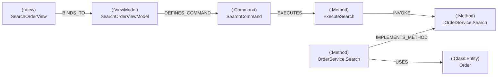

# Neo4j를 SQL · ER 다이어그램으로 이해하기

> **대상 독자:** MS SQL Server 기반 RDB 개발자. ER 다이어그램·T-SQL·JOIN에는 익숙하지만 Neo4j/Cypher는 처음.
> **목표:** 이 저장소(CodeWiki / Strazh)가 만드는 **코드 지식 그래프**를 읽고 분석할 수 있게, 관계형 개념을 그래프 개념으로 1:1 번역한다.

---

## 0. 한 문장 요약

> **Neo4j는 "JOIN을 미리 해둔 데이터베이스"다.** 관계형에서 외래키로 매번 조인하던 것을, 그래프에서는 **관계(화살표)를 디스크에 물리적으로 저장**해 두고 포인터를 따라가듯 순회한다. 그래서 "A가 호출하는 메서드가 호출하는 메서드가 구현하는 인터페이스…" 같은 **여러 단계 추적**이 SQL의 재귀 CTE 없이 자연스럽게 표현된다.

이 저장소의 그래프는 곧 **C# 코드의 ER 다이어그램**이다. 단지 그 ER이 테이블이 아니라 살아있는 그래프로 적재돼 있을 뿐이다.

---

## 1. 핵심 멘탈 모델 전환

관계형의 4대 요소가 그래프에서 무엇이 되는지부터.

| 관계형 (MS SQL / ER) | Neo4j (그래프) | 이 프로젝트의 예 |
|---|---|---|
| **테이블** (`Method`, `Class`) | **노드 라벨** (`:Method`, `:Class`) | `(:Method)`, `(:Interface)` |
| **행 (row)** | **노드 (node)** | 메서드 하나 = 노드 하나 |
| **컬럼 (스칼라)** | **노드 프로퍼티** | `m.name`, `m.fullName`, `m.pk` |
| **기본키 (PK)** | **프로퍼티 + (선택)제약** | `pk` (FNV-1a 해시) |
| **외래키 (FK)** | **관계 (relationship/edge)** | `(a)-[:INVOKE]->(b)` |
| **다대다 조인 테이블** | **관계 (그 자체)** | `INVOKE`, `IMPLEMENTS_METHOD` |
| **JOIN** | **패턴 매칭 / 순회 (traversal)** | `(a)-[:INVOKE]->(b)` |
| **JOIN 컬럼에 값 (예: 조인 테이블의 `Quantity`)** | **관계 프로퍼티** | `REGISTERS`의 `lifetime` |
| **재귀 CTE (`WITH ... UNION ALL`)** | **가변 길이 경로** | `-[:INVOKE*1..4]->` |
| **`WHERE`, `ORDER BY`, `GROUP BY`** | **`WHERE`, `ORDER BY`, 집계 함수** | 거의 동일 |

**가장 중요한 두 가지 차이:**

1. **관계가 1급 시민이다.** 관계형에서 "A가 B를 호출한다"를 표현하려면 `Invoke(CallerId, CalleeId)` 조인 테이블을 만들고 매 질의마다 JOIN해야 한다. 그래프에서는 `(A)-[:INVOKE]->(B)` 화살표가 **데이터로서 저장**돼 있어, 조인 테이블도 JOIN 키워드도 없다. 화살표를 그냥 따라간다.

2. **스키마가 강제되지 않는다 (schema-optional).** `CREATE TABLE`로 컬럼을 미리 선언하지 않는다. 노드마다 프로퍼티가 달라도 된다. 이 프로젝트에서 `:Method` 노드는 `arguments`/`returnType`를 갖지만 `:Folder` 노드는 안 갖는다 — 같은 DB 안에서. (그래서 "이 노드에 무슨 프로퍼티가 있나?"는 코드/쿡북을 봐야 한다. → §7)

---

## 2. 이 프로젝트의 그래프를 ER 다이어그램으로 본다면

익숙한 ER 표기로 먼저 그려보자. **엔티티(박스) = 노드 라벨**, **관계선 = 엣지 타입**이다.

```mermaid
erDiagram
    Class   ||--o{ Method        : "HAVE (보유)"
    Class   ||--o{ Class         : "OF_TYPE (상속)"
    Method  ||--o{ Method        : "INVOKE (호출)"
    Method  ||--o{ Method        : "IMPLEMENTS_METHOD (구현)"
    Method  ||--o{ Class         : "USES (Repository<T> 엔티티)"
    Class   ||--o{ Command       : "DEFINES_COMMAND"
    Command ||--o{ Method        : "EXECUTES (핸들러)"
    View    ||--o{ ViewModel     : "BINDS_TO"
    Interface ||--o{ Class       : "REGISTERS (DI, lifetime)"
```

> ⚠️ ER 표기의 한계: 위 그림은 "어떤 라벨이 어떤 관계로 이어지나"의 **스키마(메타모델)**다. 실제 그래프에서는 이 박스 하나가 수백~수천 개의 노드 인스턴스다 (`:Method` 노드 ~수만 개).

같은 것을 **그래프 인스턴스**로 보면 (실제 데이터 한 조각):



이 한 장이 곧 **"화면 → DB까지의 한 줄 추적"** 이고, 이게 그래프를 쓰는 이유다(§5).

---

## 3. 노드와 관계를 코드로 읽는 법

### 노드 = "라벨 붙은 행"

ASCII로 노드 하나는 소괄호 `( )`로 쓴다.

```cypher
(m:Method { name: "Search", fullName: "N.OrderService.Search" })
```

이건 SQL의:

```sql
-- Method 테이블의 한 행
SELECT * FROM Method WHERE fullName = 'N.OrderService.Search';
```

- `m` : 변수(별칭, SQL의 테이블 별칭 `FROM Method m`과 같음)
- `:Method` : 라벨(= 테이블명)
- `{ ... }` : 프로퍼티(= 컬럼 값)

### 다중 라벨 — 한 행이 여러 테이블에 동시에 속하는 셈

이 프로젝트의 핵심 특징. 한 노드가 **주 라벨 1개 + 역할 라벨 N개**를 가진다.

```cypher
(:Class:ViewModel)      // Class이면서 ViewModel
(:Class:Service)        // Class이면서 Service
(:Class:Entity)         // Class이면서 Entity (DB 엔티티)
```

관계형에는 깔끔한 대응이 없다 (서브타입 테이블이나 `IsViewModel BIT` 플래그 컬럼 여러 개로 흉내낼 것이다). 그래프에서는 그냥 라벨을 여러 개 붙인다. 질의할 때 `(:ViewModel)`로 시작하면 "ViewModel 역할인 클래스만" 바로 좁혀진다.

### 관계 = "방향 있는, 타입 있는, 프로퍼티 있는 화살표"

```cypher
(i:Interface)-[r:REGISTERS { lifetime: "Scoped" }]->(impl:Class)
```

- `-[ ]->` : 방향 있는 화살표 (A에서 B로)
- `:REGISTERS` : 관계 타입 (= 조인 테이블 이름)
- `{ lifetime: ... }` : 관계 프로퍼티 (= 조인 테이블의 추가 컬럼)

이건 SQL에서 이렇게 모델링할 것이다:

```sql
CREATE TABLE Registers (
    InterfaceId INT REFERENCES [Interface](Id),
    ClassId     INT REFERENCES [Class](Id),
    Lifetime    NVARCHAR(20)   -- 'Scoped' | 'Singleton' | 'Transient'
);
```

즉 **`REGISTERS` 관계 하나 = `Registers` 조인 테이블 + 그 안의 `Lifetime` 컬럼**. 그래프에서는 이게 화살표 한 개로 압축된다.

---

## 4. SQL ↔ Cypher 나란히 보기

같은 질문을, 이 코드 그래프를 관계형으로 모델링했다고 가정한 T-SQL과, 실제 Cypher로 비교한다.

### 예제 A — "OrderService 클래스가 가진 메서드 목록"

가정 관계형 스키마: `Class(Id, Name)`, `Method(Id, Name, ClassId FK)`.

```sql
-- T-SQL
SELECT m.Name
FROM   Method m
JOIN   [Class] c ON c.Id = m.ClassId
WHERE  c.Name = 'OrderService';
```

```cypher
// Cypher — 'HAVE' 관계를 따라간다
MATCH (c:Class { name: "OrderService" })-[:HAVE]->(m:Method)
RETURN m.name;
```

- `MATCH` = `FROM` + `JOIN` + `WHERE`의 패턴 부분.
- 조인 조건(`ON c.Id = m.ClassId`)이 사라졌다 — 관계 `:HAVE`가 그 조인을 *대신*한다.
- `RETURN` = `SELECT`.

### 예제 B — "DI에 등록된 인터페이스→구현과 생명주기" (관계 프로퍼티)

```sql
-- T-SQL
SELECT i.Name AS [Interface], c.Name AS [Impl], r.Lifetime
FROM   Registers r
JOIN   [Interface] i ON i.Id = r.InterfaceId
JOIN   [Class]     c ON c.Id = r.ClassId;
```

```cypher
// Cypher
MATCH (i:Interface)-[r:REGISTERS]->(impl:Class)
RETURN i.name, impl.name, r.lifetime;
```

조인 테이블 `Registers`가 통째로 `-[r:REGISTERS]->` 하나가 됐고, 그 컬럼 `Lifetime`은 `r.lifetime` 관계 프로퍼티가 됐다.

### 예제 C — "메서드 호출 체인 추적" (그래프가 압도적인 지점)

"`ExecuteSearch` 핸들러에서 시작해 **최대 4단계까지** 호출되는 모든 메서드."

```sql
-- T-SQL: 재귀 CTE 필요
WITH CallChain AS (
    SELECT CallerId, CalleeId, 1 AS depth
    FROM   Invoke
    WHERE  CallerId = @startMethodId
    UNION ALL
    SELECT i.CallerId, i.CalleeId, cc.depth + 1
    FROM   Invoke i
    JOIN   CallChain cc ON i.CallerId = cc.CalleeId
    WHERE  cc.depth < 4
)
SELECT DISTINCT CalleeId FROM CallChain;
```

```cypher
// Cypher: 가변 길이 경로 한 줄
MATCH (h:Method { name: "ExecuteSearch" })-[:INVOKE*1..4]->(target:Method)
RETURN DISTINCT target.fullName;
```

- `*1..4` = "이 관계를 1~4번 반복해서 따라가라". 재귀 CTE의 `UNION ALL` + `depth < 4`가 이 **세 글자**로 끝난다.
- 이게 코드 분석에 그래프를 쓰는 **핵심 이유**다. 호출 체인·상속 체인·의존 체인은 본질적으로 "가변 깊이 순회"인데, 관계형에서는 매번 재귀 CTE를 짜야 하고 그래프에서는 일급 문법이다.

### 예제 D — "화면에서 DB까지 E2E" (이 프로젝트의 대표 질의)

```cypher
MATCH (v:View {name: $viewName})-[:BINDS_TO]->(vm:ViewModel)
MATCH (vm)-[:DEFINES_COMMAND]->(cmd:Command)-[:EXECUTES]->(h:Method)
MATCH (h)-[:INVOKE*1..4]->(im:Method)<-[:IMPLEMENTS_METHOD]-(impl:Method)
MATCH (impl)-[:USES]->(e:Entity)
RETURN v.name, vm.name, cmd.name, h.name, im.fullName, impl.fullName, e.name;
```

이걸 T-SQL로 쓰면 7개 테이블 조인 + 중간에 재귀 CTE가 섞인 수십 줄이 된다. Cypher에서는 **화살표를 그린 그대로** 읽힌다. 화살표 방향 주의:
- `(im)<-[:IMPLEMENTS_METHOD]-(impl)` : 화살표가 **왼쪽**을 가리킨다. "impl이 im을 구현한다"이므로 `impl → im` 방향인데, 패턴에서는 오른쪽 노드에서 왼쪽으로 그렸다. 방향만 맞으면 어느 쪽으로 그려도 된다.

---

## 5. 왜 이 문제(코드 분석)에 그래프인가

당신이 RDB 개발자로서 "이건 그냥 테이블로 해도 되잖아?"라고 느낄 지점에 답한다.

| 분석 질문 | 관계형 | 그래프 |
|---|---|---|
| "이 DTO를 쓰는 모든 메서드?" | 1단계 조인 — 관계형도 OK | `USES_TYPE` 1홉 |
| "이 화면이 결국 어떤 DB 테이블을 건드리나?" | 5~7 테이블 조인 + 재귀 | 화살표 체인 한 줄 |
| "클라이언트 버튼 → 서버 구현 연결" | 경계마다 매핑 테이블·문자열 조인 | `IMPLEMENTS_METHOD`로 자동 봉합 |
| "프로젝트 순환 의존 있나?" | 재귀 CTE + 사이클 감지 로직 | `(p)-[:DEPENDS_ON*2..]->(p)` |
| "A를 바꾸면 영향받는 범위 N단계" | 깊이마다 재귀 | `*1..N` |

**경계 관통**(§ 쿡북 3)이 특히 그렇다. WPF 클라이언트의 프록시 메서드와 서버 서비스 구현이 둘 다 같은 `IOrderService.Search` 인터페이스 멤버를 `IMPLEMENTS_METHOD`로 가리킨다. 그래서 그 인터페이스 `Method` 노드가 **자동으로 다리**가 된다 — 관계형이라면 "클라 메서드 ↔ 서버 메서드"를 잇는 별도 매핑을 사람이 유지해야 한다.

---

## 6. 코드 속 Cypher 읽는 법 — `Neo4jLoader`의 적재 쿼리

재작성 계획의 [Neo4jLoader](../docs/superpowers/plans/2026-06-07-code-wiki-etl-rewrite.md)가 생성하는 Cypher를 RDB 관점으로 해설한다. 세 종류뿐이다.

### ① 노드 MERGE = "UPSERT (있으면 UPDATE, 없으면 INSERT)"

```cypher
UNWIND $batch AS row
MERGE (n:Class { pk: row.pk })
SET   n += row.props, n.name = row.name, n.fullName = row.fullName
```

- **`UNWIND $batch AS row`** : 파라미터로 넘긴 배열을 행 집합으로 푼다. T-SQL의 **테이블 값 파라미터(TVP)** 를 `SELECT * FROM @batch`로 펼치는 것과 같다. 한 번의 왕복으로 수천 건 처리(배치 INSERT).
- **`MERGE (n:Class { pk: row.pk })`** : `pk`로 노드를 찾고, 없으면 만든다. 정확히 SQL Server의 `MERGE`(UPSERT) 또는 "있으면 UPDATE 없으면 INSERT" 패턴.
- **`SET n += row.props`** : `row.props` 맵의 키/값을 노드 컬럼으로 **병합 설정**(`+=`는 "있는 키만 갱신, 나머지 유지"). `props`가 `Dictionary`라서 새 속성(L0의 `sourcePath` 등)을 추가해도 이 쿼리는 안 바뀐다.

동등한 T-SQL 감각:
```sql
MERGE [Class] AS tgt
USING @batch AS src ON tgt.pk = src.pk
WHEN MATCHED THEN UPDATE SET Name = src.name, FullName = src.fullName
WHEN NOT MATCHED THEN INSERT (pk, Name, FullName) VALUES (src.pk, src.name, src.fullName);
```

### ② 역할 라벨 SET = "서브타입 플래그 켜기"

```cypher
UNWIND $pks AS pk
MATCH (n { pk: pk })
SET   n:ViewModel
```

`pk`로 노드를 찾아 `:ViewModel` 라벨을 **추가**한다. 관계형이라면 `UPDATE Class SET IsViewModel = 1 WHERE pk IN (...)`에 해당. 라벨은 동적으로 붙일 수 있다(스키마리스).

### ③ 관계 MERGE = "조인 테이블에 행 UPSERT"

```cypher
UNWIND $batch AS row
MERGE (a:Command { pk: row.from })
MERGE (b:Method  { pk: row.to })
MERGE (a)-[r:EXECUTES]->(b)
SET   r += row.props
```

- 양 끝 노드를 `pk`로 찾고(이미 ①에서 만들어둠), 그 사이에 `EXECUTES` 화살표를 UPSERT.
- T-SQL: `INSERT INTO Executes(CommandId, MethodId) SELECT ... WHERE NOT EXISTS (...)`.
- `MERGE`라서 같은 화살표를 두 번 적재해도 중복이 안 생긴다(멱등).

> **왜 노드 먼저, 관계 나중?** 관계 MERGE의 `(a:Command { pk })`는 노드가 이미 있으면 그냥 MATCH한다. 노드를 ①에서 전부 만들어 두면 ③은 화살표만 그리면 된다 — FK 무결성을 위해 부모 행을 먼저 INSERT하는 것과 같은 순서.

---

## 7. RDB 개발자가 자주 막히는 포인트

1. **"이 노드에 무슨 컬럼 있어?" 가 DDL에 없다.** 스키마리스라 `CREATE TABLE` 정의서가 없다. 대신 **[스키마 쿡북](cookbook/schema-cookbook.md)** 이 그 역할을 한다 — 라벨별 프로퍼티·관계 목록이 거기 있다. 실시간 확인은:
   ```cypher
   CALL db.schema.visualization();   // 라벨/관계 메타 그래프 (ER 다이어그램 격)
   CALL db.labels();                 // 모든 라벨 목록
   CALL db.relationshipTypes();      // 모든 관계 타입
   ```

2. **방향(direction)을 빼먹는다.** `-[:INVOKE]->`(방향)와 `-[:INVOKE]-`(무방향)는 다르다. "누가 누구를 호출하나"는 방향이 의미를 가진다. 방향을 모르겠으면 `-[:INVOKE]-`로 무방향 매칭 후 확인.

3. **`NULL` 조인이 아니라 그냥 "관계 없음".** 관계형의 LEFT JOIN + `IS NULL` 대신 `OPTIONAL MATCH`(없으면 NULL 바인딩) 또는 `WHERE NOT (a)-[:X]->()`(관계 부재) 패턴을 쓴다.

4. **"테이블 전체 스캔"을 조심.** `MATCH (n) RETURN n`은 `SELECT * FROM 모든테이블`이다(수만 노드). 항상 라벨·프로퍼티로 시작점을 좁혀라: `MATCH (vm:ViewModel { name: $x })`.

5. **`pk`로 식별, `name`은 충돌 가능.** `name`은 짧은 이름이라 네임스페이스 간 동명이 있다. 정밀 식별은 `fullName` 또는 `pk`(FNV-1a 해시).

6. **빈 결과 ≠ 코드에 없음.** 추출 커버리지 한계(빌드 실패 모듈 등, 쿡북 §5)일 수 있다. 0건이 나오면 데이터 한계부터 의심.

---

## 8. Cypher 빠른 참조 (SQL 대조)

| 하고 싶은 것 | SQL | Cypher |
|---|---|---|
| 행/노드 조회 | `SELECT * FROM Method` | `MATCH (m:Method) RETURN m` |
| 조건 | `WHERE name = 'X'` | `WHERE m.name = 'X'` (또는 `{name:'X'}`) |
| 조인 | `JOIN ... ON ...` | `(a)-[:REL]->(b)` 패턴 |
| 외부 조인 | `LEFT JOIN` | `OPTIONAL MATCH` |
| 정렬 | `ORDER BY` | `ORDER BY` (동일) |
| 상위 N | `TOP 10` / `OFFSET FETCH` | `LIMIT 10` / `SKIP n LIMIT m` |
| 집계 | `COUNT(*) ... GROUP BY` | `count(*)` (GROUP BY는 RETURN의 비집계 키로 암시) |
| 중복 제거 | `DISTINCT` | `DISTINCT` (동일) |
| UPSERT | `MERGE` | `MERGE` (개념 동일) |
| 배치 입력 | TVP `@batch` | `UNWIND $batch AS row` |
| 재귀 | 재귀 CTE | `-[:REL*1..n]->` 가변 길이 |
| 라벨/타입 확인 | `INFORMATION_SCHEMA` | `db.labels()`, `db.schema.visualization()` |

**암시적 GROUP BY 주의:** Cypher에는 `GROUP BY`가 없다. `RETURN c.name, count(m)`처럼 쓰면 **비집계 항목(`c.name`)이 자동으로 그룹 키**가 된다. T-SQL 습관으로 `GROUP BY`를 찾지 말 것.

---

## 9. 다음 단계 (직접 해볼 때)

1. Neo4j Browser(`http://localhost:7474`)를 연다 — SSMS의 쿼리 창에 해당. 결과를 **그래프로 시각화**해주므로 화살표를 눈으로 따라가며 익히기 좋다.
2. `CALL db.schema.visualization()`로 이 그래프의 ER 다이어그램부터 본다.
3. [스키마 쿡북](cookbook/schema-cookbook.md) §4의 검증된 Cypher를 복사해 실행하며 §4 SQL 대조표와 맞춰본다.
4. 막히면 이 문서 §7(자주 막히는 포인트)·§8(빠른 참조)로 돌아온다.

> 요약: **노드=행, 라벨=테이블, 관계=조인테이블+FK, 순회=JOIN, `*1..n`=재귀 CTE.** 이 다섯 개만 손에 익으면 이 저장소의 모든 Cypher가 읽힌다.
