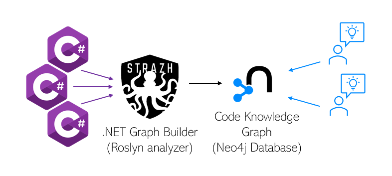

# Strazh
Your codebase - is your Knowledge Graph.

**Strazh** is a .NET Core console app to build a Codebase Knowledge Graph from a C# codebase powered by Roslyn analyzer.

**Codebase Knowledge Graph** is a graph-structured dataset with free-form relationships between entities of codebase, semantic models of programming language, project structure and other interlinked knowledges.

More details in the article [Codebase Knowledge Graph](./Documentation/codebase-knowledge-graph.pdf)

#### Documentation

[Manual run](./Documentation/manual-run.md)

[Command Line Interface](./Documentation/cli.md)
